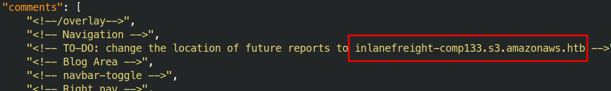
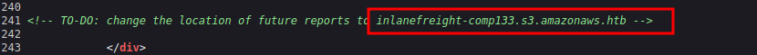
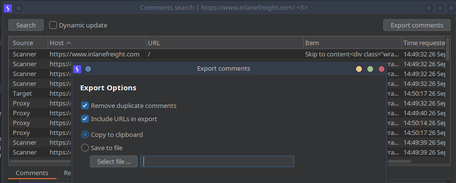
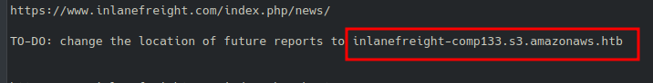

# Web Crawling

Web crawling is the automated exploration of a website's structure. A web crawler, or spider, systematically navigates through web pages by following links, mimicking a user's browsing behavior. This process maps out the site's architecture and gathers valuable information embedded within the pages.

A crucial file that guides web crawlers is `robots.txt`. This file resides in a website's root directory and dictates which areas are off-limits for crawlers. Analyzing `robots.txt` can reveal hidden directories or sensitive areas that the website owner doesn't want to be indexed by search engines.

`Scrapy` is a powerful and efficient Python framework for large-scale web crawling and scraping projects. It provides a structured approach to defining crawling rules, extracting data, and handling various output formats.

Here's a basic Scrapy spider example to extract links from `example.com`:

```python
import scrapy

class ExampleSpider(scrapy.Spider):
    name = "example"
    start_urls = ['http://example.com/']

    def parse(self, response):
        for link in response.css('a::attr(href)').getall():
            if any(link.endswith(ext) for ext in self.interesting_extensions):
                yield {"file": link}
            elif not link.startswith("#") and not link.startswith("mailto:"):
                yield response.follow(link, callback=self.parse)
```

After running the Scrapy spider, you'll have a file containing scraped data (e.g., `example_data.json`). You can analyze these results using standard command-line tools. For instance, to extract all links:


```bash
jq -r '.[] | select(.file != null) | .file' example_data.json | sort -u
```

This command uses `jq` to select non-null file values and `sort` with the `-u` option to sort and deduplicate them. The command does not use `awk` or `uniq -c`. By scrutinizing the extracted data, you can identify patterns, anomalies, or sensitive files that might be of interest for further investigation.

> After spidering inlanefreight.com, identify the location where future reports will be stored. Respond with the full domain, e.g., files.inlanefreight.com.

##### Use a Virtual Environment

You can create an isolated Python environment where you can install packages like `scrapy` without affecting the system:

```bash
python3 -m venv ~/myvenv
source ~/myvenv/bin/activate
pip install scrapy
python3 ReconSpider.py http://inlanefreight.com
```



To deactivate the virtual environment, simply run:

```bash
deactivate
```








## Estado del ejemplo Scrapy

El ejemplo `ExampleSpider` referencia `self.interesting_extensions` sin definir ese atributo. Es un fragmento incompleto y no puede ejecutarse tal cual. Tampoco se especifica la orden que escribe `example_data.json`; el bloque posterior presupone ese archivo.

## Crawling

| **Resource/Command**                                                                                                                                 | **Description**                                                               |
| ---------------------------------------------------------------------------------------------------------------------------------------------------- | ----------------------------------------------------------------------------- |
| `ZAP`                                                                                                                                                | [https://www.zaproxy.org/](https://www.zaproxy.org/)                          |
| `ffuf -recursion -recursion-depth 1 -u http://192.168.10.10/FUZZ -w /opt/useful/SecLists/Discovery/Web-Content/raft-small-directories-lowercase.txt` | Discovering files and folders that cannot be spotted by browsing the website. |
| `ffuf -w ./folders.txt:FOLDERS,./wordlist.txt:WORDLIST,./extensions.txt:EXTENSIONS -u http://www.target.domain/FOLDERS/WORDLISTEXTENSIONS`           | Mutated bruteforcing against the target web server.                           |
