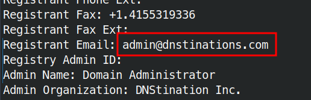

# WHOIS

```bash
whois paypal.com
```

> Perform a WHOIS lookup against the paypal.com domain. What is the registrar Internet Assigned Numbers Authority (IANA) ID number?

*Captura omitida por posibles datos sensibles.*

> What is the admin email contact for the tesla.com domain (also in-scope for the Tesla bug bounty program)?



## Referencia complementaria

WHOIS is a query and response protocol used to retrieve information about domain names, IP addresses, and other internet resources. It's essentially a directory service that details who owns a domain, when it was registered, contact information, and more. In the context of web reconnaissance, WHOIS lookups can be a valuable source of information, potentially revealing the identity of the website owner, their contact information, and other details that could be used for further investigation or social engineering attacks.

For example, if you wanted to find out who owns the domain `example.com`, you could run the following command in your terminal:


```bash
whois example.com
```

This would return a wealth of information, including the registrar, registration, and expiration dates, nameservers, and contact information for the domain owner.

However, it's important to note that WHOIS data can be inaccurate or intentionally obscured, so it's always wise to verify the information from multiple sources. Privacy services can also mask the true owner of a domain, making it more difficult to obtain accurate information through WHOIS.

## WHOIS

| **Command**                  | **Description**                           |
| ---------------------------- | ----------------------------------------- |
| `export TARGET="domain.tld"` | Assign target to an environment variable. |
| `whois $TARGET`              | WHOIS lookup for the target.              |
