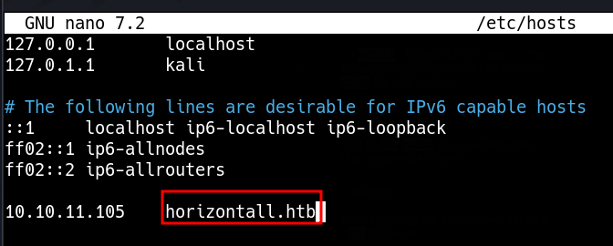
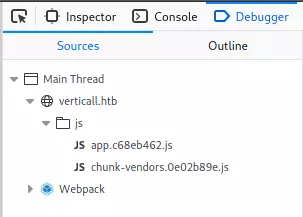

# Servicios web: identificación e inventario

```bash
whatweb http://$IP
```

## Hosts, puertos y capturas

| Comando | Descripción |
| --- | --- |
| `sudo vim /etc/hosts`                                                                                                                                                                                                                         | Opens the `/etc/hosts` with `vim` to start adding hostnames                                                                                                                                                                    |
| `sudo nmap -p 80,443,8000,8080,8180,8888,10000 --open -oA web_discovery -iL scope_list`                                                                                                                                                       | Runs an nmap scan using common web application ports based on a scope list (`scope_list`) and outputs to a file (`web_discovery`) in all formats (`-oA`)                                                                       |
| `eyewitness --web -x web_discovery.xml -d <nameofdirectorytobecreated>`                                                                                                                                                                       | Runs `eyewitness` using a file generated by an nmap scan (`web_discovery.xml`) and creates a directory (`-d`)                                                                                                                  |
| `cat web_discovery.xml \| ./aquatone -nmap`                                                                                                                                                                                                   | Concatenates the contents of nmap scan output (web\_discovery.xml) and pipes it to aquatone (`./aquatone`) while ensuring aquatone recognizes the file as nmap scan output (`-nmap`)                                           |

## Relacionado

- [Opciones y ejemplos de Nmap](../Tools/nmap-options.md)
- [Gobuster](../Tools/gobuster.md)
- [ffuf](../Tools/ffuf.md)

## Resolución local de nombres

Add the domain to /etc/hosts



```bash
echo "10.10.11.105 horizontall.htb" | sudo tee -a /etc/hosts
```

## Consulta del HTML

ctrl + u 

```bash
curl -s -X GET "http://$IP" | batcat -l html
```

## Herramientas del navegador



## Consulta de rutas HTTP

```bash
nmap --script http-enum -p80 $IP
```

## Hosts virtuales con wfuzz

```bash
wfuzz -u http://office.paper -H "Host: FUZZ.office.paper" -w /usr/share/seclists/Discovery/DNS/subdomains-top1million-5000.txt --hh 199691
```
