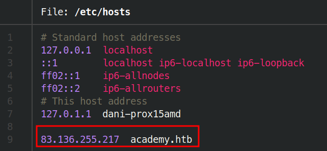
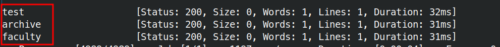
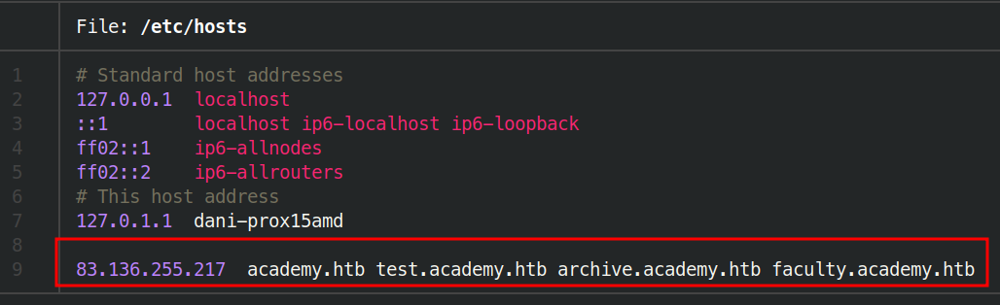
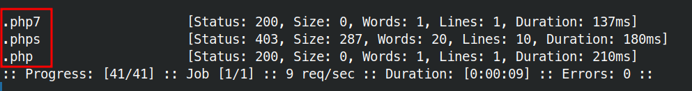
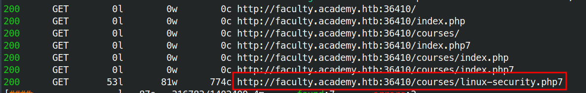
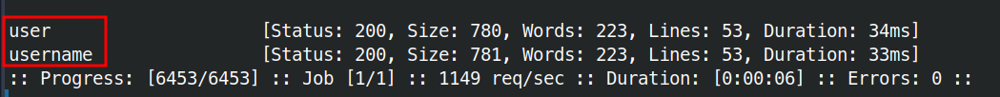
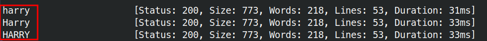
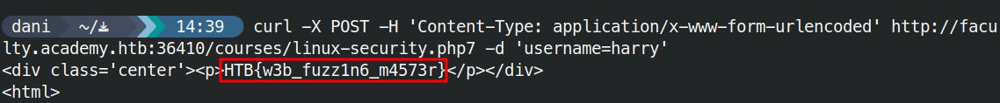

# Skills Assessment



## VHost 

```bash
ffuf -w /usr/share/seclists/Discovery/DNS/subdomains-top1million-5000.txt:FUZZ -u http://academy.htb:36410/ -H 'Host: FUZZ.academy.htb' -fs 985
```




## Extension 

```bash
ffuf -w /usr/share/seclists/Discovery/Web-Content/web-extensions.txt:FUZZ -u http://faculty.academy.htb:36410/indexFUZZ
```



## Recursive 

```bash
feroxbuster -u http://faculty.academy.htb:36410/ -w /usr/share/seclists/Discovery/Web-Content/directory-list-2.3-small.txt -x php,phps,php7 -f -r
```



## Parameters

```bash
ffuf -w /usr/share/seclists/Discovery/Web-Content/burp-parameter-names.txt:FUZZ -u http://faculty.academy.htb:36410/courses/linux-security.php7?FUZZ=key -fs 774
```

```bash
ffuf -w /usr/share/seclists/Discovery/Web-Content/burp-parameter-names.txt:FUZZ -u http://faculty.academy.htb:36410/courses/linux-security.php7 -X POST -d 'FUZZ=key' -H 'Content-Type: application/x-www-form-urlencoded' -fs 774
```



## Username fuzzing

```bash
ffuf -w /usr/share/seclists/Usernames/xato-net-10-million-usernames.txt -u http://faculty.academy.htb:36410/courses/linux-security.php7 -X POST -d 'username=FUZZ' -H 'Content-Type: application/x-www-form-urlencoded' -fs 781
```



```bash
curl -X POST -H 'Content-Type: application/x-www-form-urlencoded' http://faculty.academy.htb:36410/courses/linux-security.php7 -d 'username=harry'
```



## Material relacionado

- [Basic Fuzzing](../../../Tools/Ffuf/basic-fuzzing.md)
- [Domain Fuzzing](../../../Tools/Ffuf/domain-fuzzing.md)
- [Parameter](../../../Tools/Ffuf/parameter.md)


## Procedencia

| Repositorio | Archivo original | Commit de origen |
| --- | --- | --- |
| CBBH | 5- Ffuf/4 - Skills Assesment.md | 284a0a42d23a00f2b47b7460371a517a14cb6261 |

[Índice de categoría](../../README.md) · [Inicio](../../../README.md)
