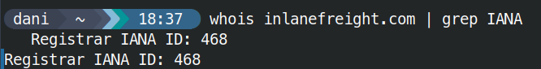
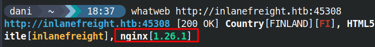
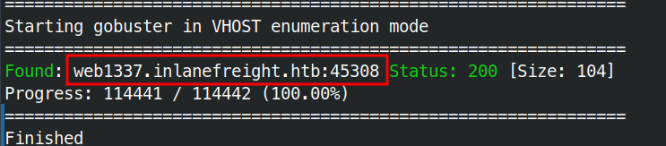
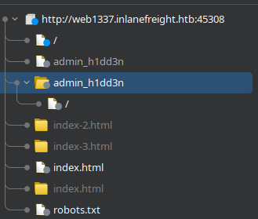
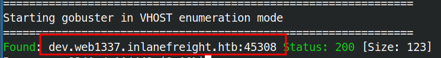
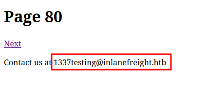
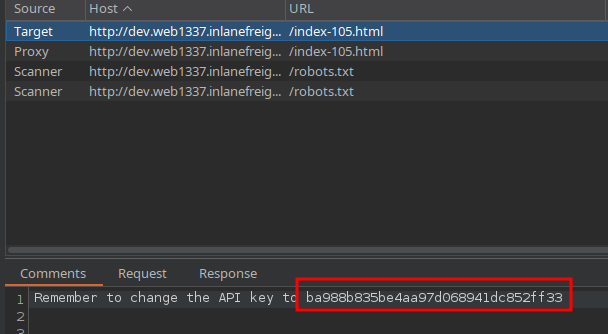

# Skills Assessment

> What is the IANA ID of the registrar of the inlanefreight.com domain?



> What http server software is powering the inlanefreight.htb site on the target system? Respond with the name of the software, not the version, e.g., Apache.



> What is the API key in the hidden admin directory that you have discovered on the target system?

```bash
gobuster vhost -u http://inlanefreight.htb:45308/ -w /usr/share/seclists/Discovery/DNS/subdo  
mains-top1million-110000.txt --append-domain
```





```text
The admin panel is currently under maintenance, but the API is still accessible with the key <REDACTED_API_KEY>
```

> After crawling the inlanefreight.htb domain on the target system, what is the email address you have found? Respond with the full email, e.g., redacted@example.invalid.

```text
gobuster vhost -u http://web1337.inlanefreight.htb:45308/ -w /usr/share/seclists/Discovery/D  
NS/subdomains-top1million-110000.txt --append-domain
```






> What is the API key the inlanefreight.htb developers will be changing too?



## Material relacionado

- [Automating Recon](../../../Enumeration/Reconnaissance/automating-recon.md)
- [Certificate Transparency (CT) Logs](../../../Enumeration/Reconnaissance/certificate-transparency-ct-logs.md)
- [DNS](../../../Enumeration/Reconnaissance/dns.md)
- [Fingerprinting](../../../Enumeration/Reconnaissance/fingerprinting.md)
- [Introduction](../../../Enumeration/Reconnaissance/introduction.md)
- [Search Engine Discovery](../../../Enumeration/Reconnaissance/search-engine-discovery.md)
- [Subdomains](../../../Enumeration/Reconnaissance/subdomains.md)
- [Virtual Hosts](../../../Enumeration/Reconnaissance/virtual-hosts.md)
- [Web Archives](../../../Enumeration/Reconnaissance/web-archives.md)
- [Web Crawling](../../../Enumeration/Reconnaissance/web-crawling.md)
- [WHOIS](../../../Enumeration/Reconnaissance/whois.md)
- [Zone Transfers](../../../Enumeration/Reconnaissance/zone-transfers.md)


## Procedencia

| Repositorio | Archivo original | Commit de origen |
| --- | --- | --- |
| CBBH | 4- Information Gathering/14 - Skills Assessment.md | 284a0a42d23a00f2b47b7460371a517a14cb6261 |

Se han sustituido valores literales de autenticación o direcciones de correo por marcadores. Los detalles sin valores están en [el registro de redacciones](../../../Resources/Audit/redactions.csv).

[Índice de categoría](../../README.md) · [Inicio](../../../README.md)
