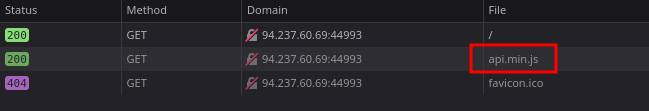
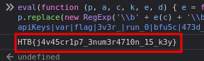

# Skills Assessment



```javascript
function apiKeys() {
    // Construct the flag
    var flag = 'HTB{' + 'n3v3r_' + 'run_0' + 'bfu5c' + '473d_' + 'c0d3!' + '}';
    // Create a new XMLHttpRequest object
    var xhr = new XMLHttpRequest();
    // Set the endpoint for the request
    var _0x437f8b = '/keys.php';
    // Open a POST request to the endpoint
    xhr.open('POST', _0x437f8b, true); // `!![]` is the same as `true`
    // Send the request with no data (null)
    xhr.send(null);
}
// Log a constructed message to the console
console.log('HTB{' + 'j4v45c' + 'r1p7_' + '3num3' + 'r4710' + 'n_15_' + 'k3y}');

```



```bash
curl -X POST http://94.237.60.69:44993/keys.php  
```

```bash
echo 4150495f70336e5f37333537316e365f31355f66756e | xxd -r -p
```

```bash
curl -X POST http://94.237.60.69:44993/keys.php -d 'key=API_p3n_73571n6_15_fun'
```

## Material relacionado

- [JS](../../../Tools/JavaScript/js.md)


## Procedencia

| Repositorio | Archivo original | Commit de origen |
| --- | --- | --- |
| CBBH | 6- Javascript Deobfuscation/2 - Skills Assessment.md | 284a0a42d23a00f2b47b7460371a517a14cb6261 |

[Índice de categoría](../../README.md) · [Inicio](../../../README.md)
