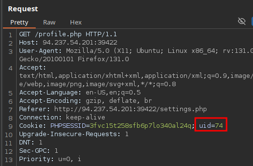
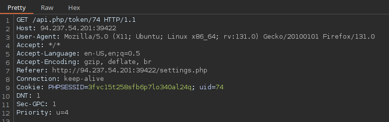
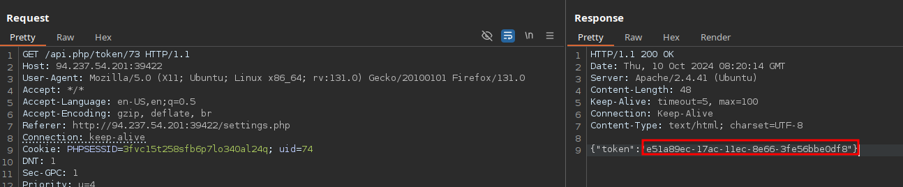
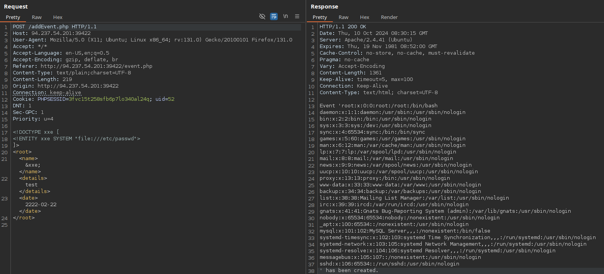
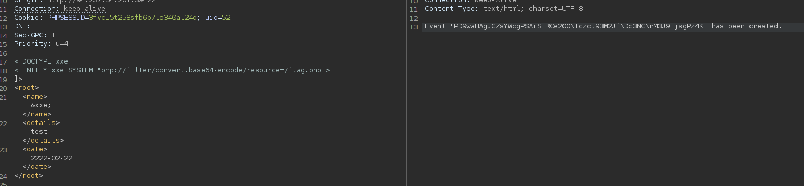

# Skills Assessment





### Change other user password



Change request method
*Captura omitida por posibles datos sensibles.*

Find a user with "company":"Administrator"

```json
{"uid":"52","username":"a.corrales","full_name":"Amor Corrales","company":"Administrator"}
```

## Add Event
### XXE






## Material relacionado

- [HTTP Verb Tampering](../../../Web-Security/Access-Control-and-XXE/http-verb-tampering.md)
- [IDOR](../../../Web-Security/Access-Control-and-XXE/idor.md)
- [XXE](../../../Web-Security/Access-Control-and-XXE/xxe.md)
