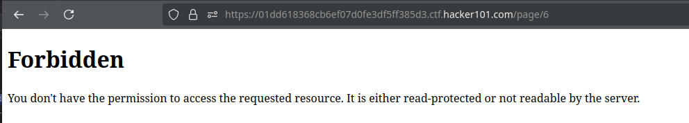
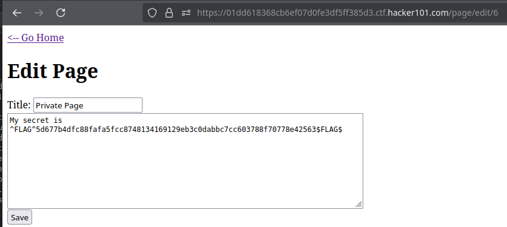
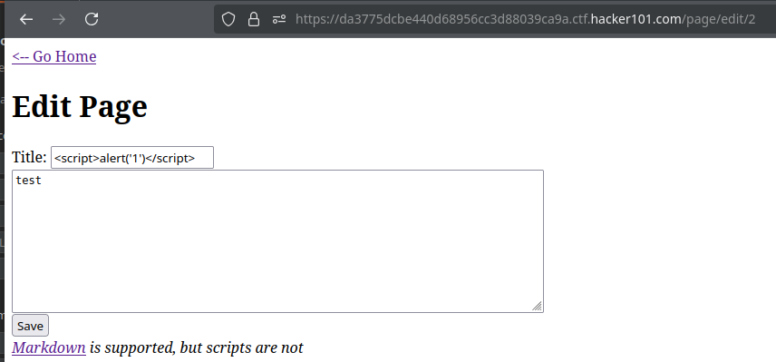
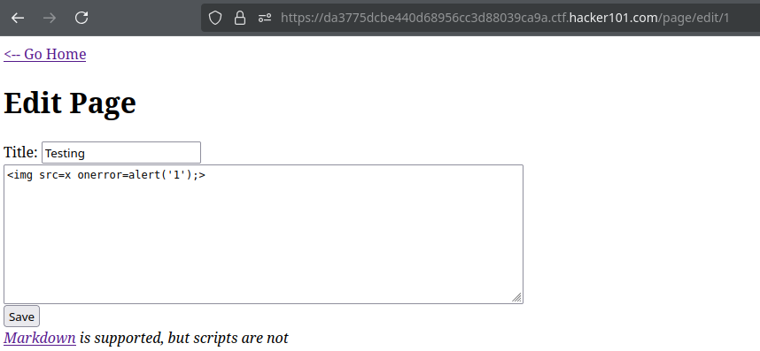
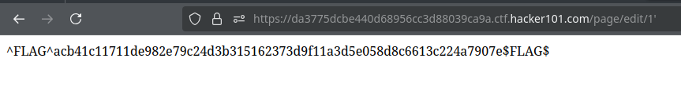

# Micro-CMS v1

## Flag1
Unauthorized Access

## Flag2
Stored XSS

## Flag3
Stored XSS 

## Flag4
SQLi

## Procedencia

| Repositorio | Archivo original | Commit de origen |
| --- | --- | --- |
| CBBH | BB/Hackerone/2 - Micro-CMS v1.md | 284a0a42d23a00f2b47b7460371a517a14cb6261 |

[Índice de categoría](../README.md) · [Inicio](../../README.md)
