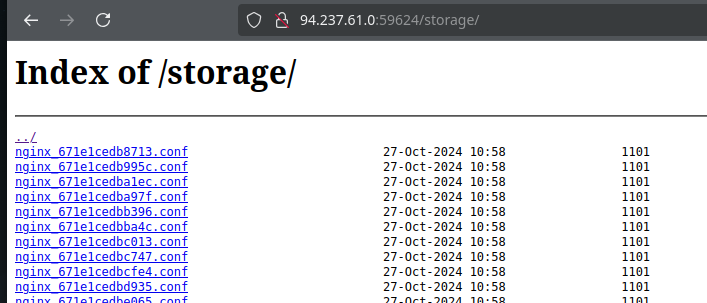
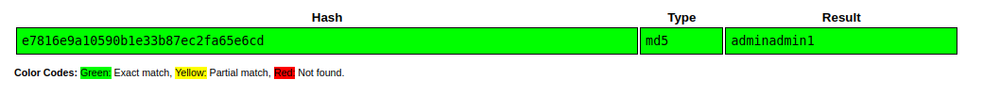

# baby nginxatsu

## Directory listing



```bash
tar -xvf v1_db_backup_1604123342.tar.gz
```

```sql
sqlite> .tables  
sqlite> select * from users;
```



```text
redacted@example.invalid:adminadmin1
```

## Procedencia

| Repositorio | Archivo original | Commit de origen |
| --- | --- | --- |
| CBBH | Owasp top 10/4 - baby nginxatsu.md | 284a0a42d23a00f2b47b7460371a517a14cb6261 |

Se han sustituido valores literales de autenticación o direcciones de correo por marcadores. Los detalles sin valores están en [el registro de redacciones](../../Resources/Audit/redactions.csv).

[Índice de categoría](../README.md) · [Inicio](../../README.md)
