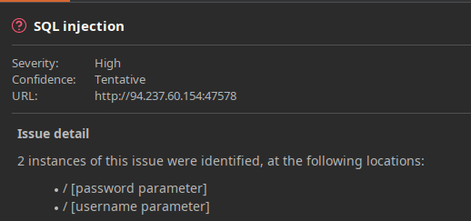

# sanitize

```text
admin' or 1=1-- -
```



## Procedencia

| Repositorio | Archivo original | Commit de origen |
| --- | --- | --- |
| CBBH | Owasp top 10/2 - sanitize.md | 284a0a42d23a00f2b47b7460371a517a14cb6261 |

[Índice de categoría](../README.md) · [Inicio](../../README.md)
