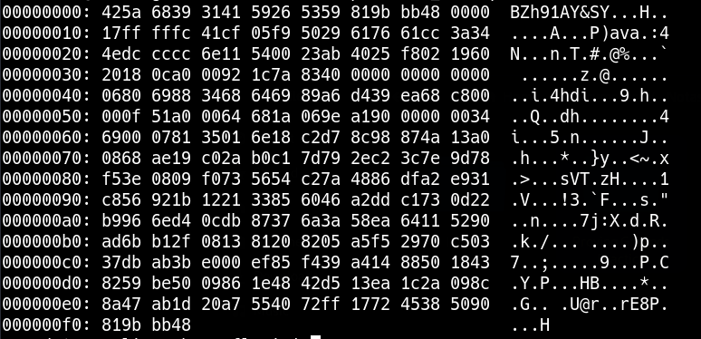

# Formatos de archivo y descompresión

## HEX



Reverse HEX

```bash
cat file | xxd -r > /tmp/file
```

## Bzip2 

```console
file /tmp/file

/tmp/file: bzip2 compressed data, block size = 900k
```

```bash
mv file file.bz2
bzip2 -d file.bz2
```

## Gzip 

```console
file /tmp/file

file: gzip compressed data, was "password", last modified: Tue May 22 19:16:20 2018, from Unix
```

```bash
mv file file.gz
gunzip file.gz
```


## Tar

```bash
mv file file.tar
tar -xf file.tar
```

## Relacionado

- [Codificación y análisis de JavaScript](../Tools/javascript-encoding.md)
