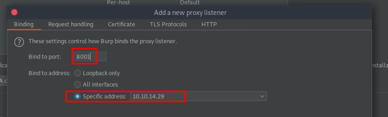

# Android emulator

```bash
sudo apt install adb snapd
systemctl start snapd.service
```

adb: android debug bridge
## Anbox

Nota histórica: Anbox está archivado y es de solo lectura desde el 13 de febrero de 2024. Estas instrucciones documentan un entorno antiguo. [Estado oficial del proyecto](https://github.com/anbox/anbox).

https://github.com/anbox/anbox

```bash
git clone https://github.com/anbox/anbox.git --recurse-submodules
cd anbox
mkdir build
cd build
cmake ..
make
```

```bash
snap install --devmode --beta anbox 
```


### install apk

```bash
adb install file.apk
```


### burpsuite

```bash
adb shell settings put global http_proxy 10.10.14.29:8001
```


