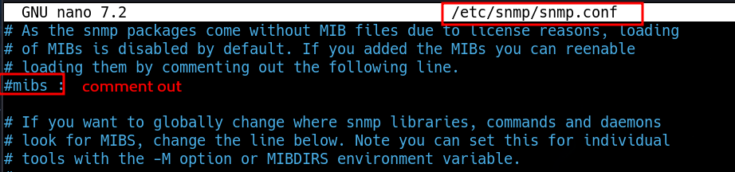

# SNMP: consulta de OID

| Comando | Descripción |
| --- | --- |
| `snmpwalk -v2c -c <community string> <FQDN/IP>`   | Querying OIDs using snmpwalk.                       |

## Consultas y nombres de MIB

UDP

```bash
snmpwalk -v 2c -c public $IP
```

```text
snmpbulkwalk -c public -v2c $IP . 
```

## Readable output

`sudo apt install snmp-mibs-downloader`


