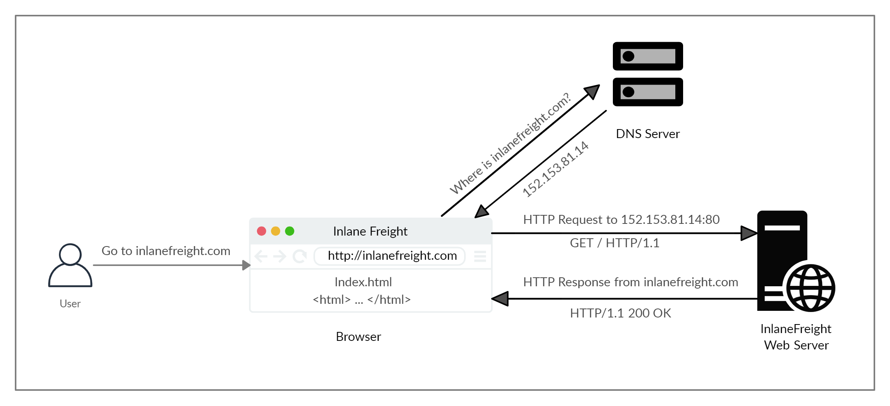
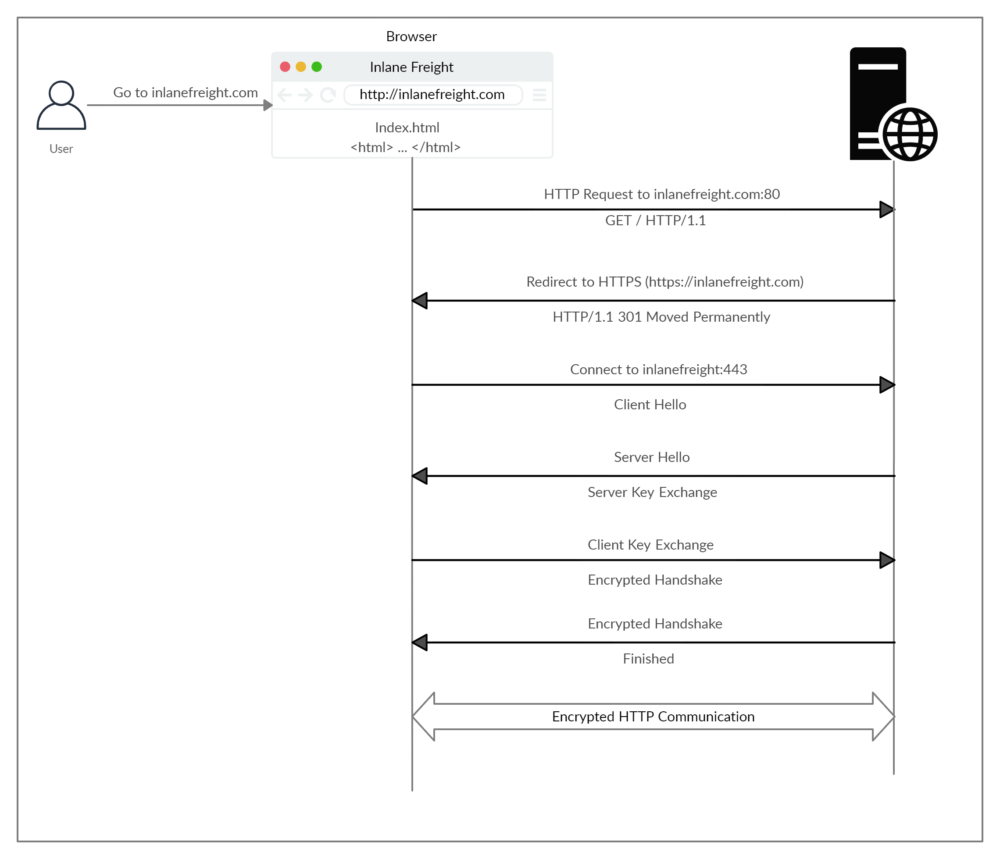
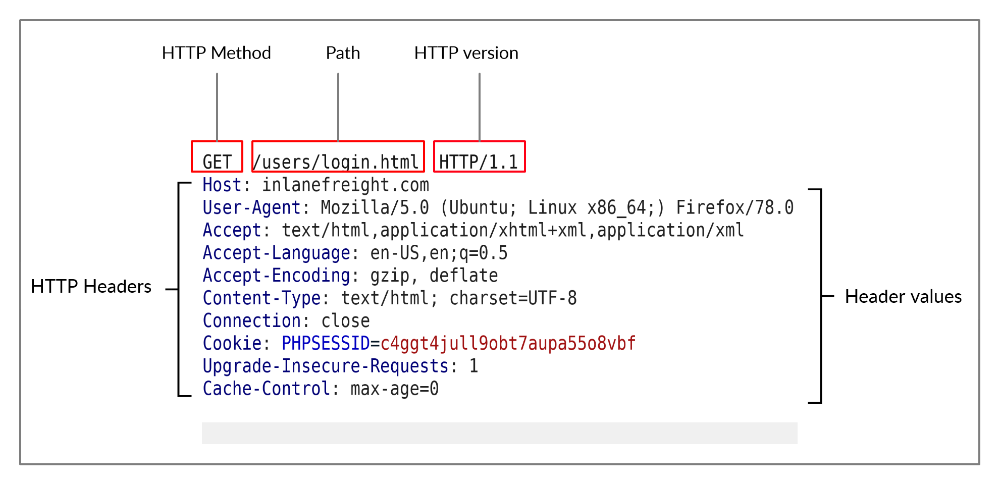
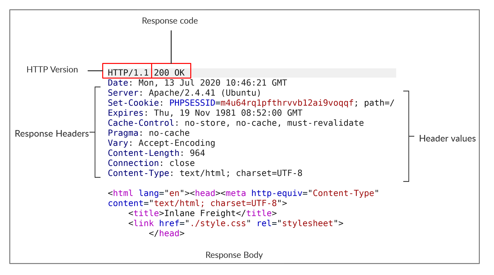

# cURL y peticiones HTTP

Referencia única para peticiones, cabeceras, autenticación de ejemplo y operaciones CRUD. Los servidores y puertos originales corresponden a ejercicios; no se ha comprobado su disponibilidad.

Correcciones editoriales: HEAD devuelve las cabeceras de una respuesta GET sin su contenido; PUT crea o reemplaza el estado del recurso. Las referencias a RFC 2616 y RFC 7231 se conservan como contexto histórico. Especificación vigente: [RFC 9110](https://www.rfc-editor.org/rfc/rfc9110.html).

## HTTP

### URL
[Captura pendiente de revisión: Pasted image 20240920054847.png](../Resources/Audit/media.csv)

### Flow



### Curl

```bash
curl 83.136.249.80:41794/download.php
```

```bash
 -d, --data <data>   HTTP POST data
 -h, --help <category> Get help for commands
 -i, --include       Include protocol response headers in the output
 -o, --output <file> Write to file instead of stdout
 -O, --remote-name   Write output to a file named as the remote file
 -s, --silent        Silent mode
 -u, --user <user:password> Server user and password
 -A, --user-agent <name> Send User-Agent <name> to server
 -v, --verbose       Make the operation more talkative
```

## HTTPS

### Flow



### Curl

To skip the certificate check with cURL, we can use the `-k` flag:

```bash
curl -k https://inlanefreight.com
```

## HTTP Requests and Responses

### Request


### Response


### Curl

```bash
curl -v 83.136.249.80:41794
```

## HTTP Headers

### General headers
[General headers](https://www.w3.org/Protocols/rfc2616/rfc2616-sec4.html) are used in both HTTP requests and responses. They are contextual and are used to `describe the message rather than its contents`.

### Entity headers
Similar to general headers, [Entity Headers](https://www.w3.org/Protocols/rfc2616/rfc2616-sec7.html) can be `common to both the request and response`. These headers are used to `describe the content` (entity) transferred by a message. They are usually found in responses and POST or PUT requests.

### Request headers
The client sends [Request Headers](https://tools.ietf.org/html/rfc2616) in an HTTP transaction. These headers are `used in an HTTP request and do not relate to the content` of the message. The following headers are commonly seen in HTTP requests.

### Response Headers
[Response Headers](https://tools.ietf.org/html/rfc7231#section-7) can be `used in an HTTP response and do not relate to the content`. Certain response headers such as `Age`, `Location`, and `Server` are used to provide more context about the response. The following headers are commonly seen in HTTP responses.

### Security Headers
Finally, we have [Security Headers](https://owasp.org/www-project-secure-headers/). With the increase in the variety of browsers and web-based attacks, defining certain headers that enhanced security was necessary. HTTP Security headers are `a class of response headers used to specify certain rules and policies` to be followed by the browser while accessing the website.

### Curl

```bash
curl 94.237.53.113:51370 -A 'Mozilla/5.0' -I -v
```

## HTTP Methods and Codes

### Request Methods

| **Method** | **Description**                                                                                                                                                                                                                                                                                                                      |
| ---------- | ------------------------------------------------------------------------------------------------------------------------------------------------------------------------------------------------------------------------------------------------------------------------------------------------------------------------------------ |
| `GET`      | Requests a specific resource. Additional data can be passed to the server via query strings in the URL (e.g. `?param=value`).                                                                                                                                                                                                        |
| `POST`     | Sends data to the server. It can handle multiple types of input, such as text, PDFs, and other forms of binary data. This data is appended in the request body present after the headers. The POST method is commonly used when sending information (e.g. forms/logins) or uploading data to a website, such as images or documents. |
| `HEAD`     | Requests the headers that would be returned if a GET request was made to the server. It doesn't return the response body and is usually made to check the response length before downloading resources.                                                                                                                               |
| `PUT`      | Creates or replaces the representation of the resource on the server. Allowing this method without proper controls can lead to uploading malicious resources.                                                                                                                                                                                                         |
| `DELETE`   | Deletes an existing resource on the webserver. If not properly secured, can lead to Denial of Service (DoS) by deleting critical files on the web server.                                                                                                                                                                            |
| `OPTIONS`  | Returns information about the server, such as the methods accepted by it.                                                                                                                                                                                                                                                            |
| `PATCH`    | Applies partial modifications to the resource at the specified location.                                                                                                                                                                                                                                                             |

https://developer.mozilla.org/en-US/docs/Web/HTTP/Methods

### Response Codes

HTTP status codes are used to tell the client the status of their request. An HTTP server can return five types of response codes:

| **Type** | **Description**                                                                                                                  |
| -------- | -------------------------------------------------------------------------------------------------------------------------------- |
| `1xx`    | Provides information and does not affect the processing of the request.                                                          |
| `2xx`    | Returned when a request succeeds.                                                                                                |
| `3xx`    | Returned when the server redirects the client.                                                                                   |
| `4xx`    | Signifies improper requests `from the client`. For example, requesting a resource that doesn't exist or requesting a bad format. |
| `5xx`    | Returned when there is some problem `with the HTTP server` itself.                                                               |

https://developer.mozilla.org/en-US/docs/Web/HTTP/Status

https://developers.cloudflare.com/support/troubleshooting/http-status-codes/http-status-codes/

https://docs.aws.amazon.com/AmazonSimpleDB/latest/DeveloperGuide/APIError.html

## GET

### HTTP Basic Auth

```bash
curl -u admin:admin http://<SERVER_IP>:<PORT>/
```

```bash
curl http://admin:admin@<SERVER_IP>:<PORT>/
```

### HTTP Authorization Header

```bash
curl -H 'Authorization: Basic YWRtaW46YWRtaW4=' http://<SERVER_IP>:<PORT>/
```

### GET Parameters

```bash
curl 'http://<SERVER_IP>:<PORT>/search.php?search=le' -H 'Authorization: Basic YWRtaW46YWRtaW4='
```

```bash
curl 'http://83.136.253.59:44745/search.php?search=flag' -H 'Authorization: Basic YWRtaW46YWRtaW4='
```

## POST

### Login forms

```bash
curl -X POST -d 'username=admin&password=admin' http://<SERVER_IP>:<PORT>/
```

### Authenticated Cookies

```bash
curl -X POST -d 'username=admin&password=admin' http://<SERVER_IP>:<PORT>/ -i
```

```bash
curl -b 'PHPSESSID=<REDACTED_SESSION>' http://<SERVER_IP>:<PORT>/
```

```bash
curl -H 'Cookie: PHPSESSID=<REDACTED_SESSION>' http://<SERVER_IP>:<PORT>/
```

### JSON Data

```bash
curl -X POST -d '{"search":"london"}' -b 'PHPSESSID=<REDACTED_SESSION>' -H 'Content-Type: application/json' http://<SERVER_IP>:<PORT>/search.php
["London (UK)"]
```

## CRUD API

### CRUD

| Operation | HTTP Method | Description                                        |
| --------- | ----------- | -------------------------------------------------- |
| `Create`  | `POST`      | Adds the specified data to the database table      |
| `Read`    | `GET`       | Reads the specified entity from the database table |
| `Update`  | `PUT`       | Updates the data of the specified database table   |
| `Delete`  | `DELETE`    | Removes the specified row from the database table  |

#### Read

```bash
curl -s http://<SERVER_IP>:<PORT>/api.php/city/london | jq
```

#### Create

```bash
curl -X POST http://<SERVER_IP>:<PORT>/api.php/city/ -d '{"city_name":"HTB_City", "country_name":"HTB"}' -H 'Content-Type: application/json'
```

#### Update

The HTTP `PATCH` method may also be used to update API entries instead of `PUT`. To be precise, `PATCH` is used to partially update an entry (only modify some of its data "e.g. only city_name"), while `PUT` is used to update the entire entry.

```bash
curl -X PUT http://<SERVER_IP>:<PORT>/api.php/city/london -d '{"city_name":"New_HTB_City", "country_name":"HTB"}' -H 'Content-Type: application/json'
```

#### Delete

```bash
curl -X DELETE http://<SERVER_IP>:<PORT>/api.php/city/New_HTB_City
```

## Comandos rápidos complementarios

| Comando original | Descripción |
| --- | --- |
| `curl -h`                                                                                                        | cURL help menu                                       |
| `curl inlanefreight.com`                                                                                         | Basic GET request                                    |
| `curl -s -O inlanefreight.com/index.html`                                                                        | Download file                                        |
| `curl inlanefreight.com -v`                                                                                      | Print full HTTP request/response details             |
| `curl -I https://www.inlanefreight.com`                                                                          | Send HEAD request (only prints response headers)     |
| `curl -i https://www.inlanefreight.com`                                                                          | Print response headers and response body             |
| `curl https://www.inlanefreight.com -A 'Mozilla/5.0'`                                                            | Set User-Agent header                                |
| `curl -X POST -d '{"search":"london"}' -H 'Content-Type: application/json' http://<SERVER_IP>:<PORT>/search.php` | Send POST request with JSON data                     |
|`curl http://<SERVER_IP>:<PORT>/api.php/city/london`|Read entry|
|`curl -s http://<SERVER_IP>:<PORT>/api.php/city/ \| jq`|Read all entries|

## Browser DevTools

|**Shortcut**|**Description**|
|---|---|
|[`CTRL+SHIFT+I`] or [`F12`]|Show devtools|
|[`CTRL+SHIFT+E`]|Show Network tab|
|[`CTRL+SHIFT+K`]|Show Console tab|

## Procedencia

| Repositorio | Archivo original | Commit de origen |
| --- | --- | --- |
| CBBH | 1- Web Requests/HTTP Fundamentals/1 - HTTP.md | 284a0a42d23a00f2b47b7460371a517a14cb6261 |
| CBBH | 1- Web Requests/HTTP Fundamentals/2 - HTTPS.md | 284a0a42d23a00f2b47b7460371a517a14cb6261 |
| CBBH | 1- Web Requests/HTTP Fundamentals/3 - HTTP Requests and Responses.md | 284a0a42d23a00f2b47b7460371a517a14cb6261 |
| CBBH | 1- Web Requests/HTTP Fundamentals/4 - HTTP Headers.md | 284a0a42d23a00f2b47b7460371a517a14cb6261 |
| CBBH | 1- Web Requests/HTTP Methods/1 - HTTP Methods and Codes.md | 284a0a42d23a00f2b47b7460371a517a14cb6261 |
| CBBH | 1- Web Requests/HTTP Methods/2 - GET.md | 284a0a42d23a00f2b47b7460371a517a14cb6261 |
| CBBH | 1- Web Requests/HTTP Methods/3 - POST.md | 284a0a42d23a00f2b47b7460371a517a14cb6261 |
| CBBH | 1- Web Requests/HTTP Methods/4 - CRUD API.md | 284a0a42d23a00f2b47b7460371a517a14cb6261 |
| pentestNotes | Web/1 - Web Requests.md | ea46064dea8893ed6d54216151ae1bb0ef3661ba |

Se han sustituido valores literales de autenticación o direcciones de correo por marcadores. Los detalles sin valores están en [el registro de redacciones](../Resources/Audit/redactions.csv).

[Índice de categoría](README.md) · [Inicio](../README.md)
