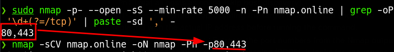

# Nmap: opciones y ejemplos

Opciones de Nmap: descubrimiento de hosts, puertos, servicios y formatos de salida.

## NMAP

#### Scanning Options

| **Nmap Option**      | **Description**                                                        |
| -------------------- | ---------------------------------------------------------------------- |
| `10.10.10.0/24`      | Target network range.                                                  |
| `-sn`                | Disables port scanning.                                                |
| `-Pn`                | Skips host discovery; treats the specified hosts as online                                            |
| `-n`                 | Disables DNS Resolution.                                               |
| `-PE`                | Performs the ping scan by using ICMP Echo Requests against the target. |
| `--packet-trace`     | Shows all packets sent and received.                                   |
| `--reason`           | Displays the reason for a specific result.                             |
| `--disable-arp-ping` | Disables ARP Ping Requests.                                            |
| `--top-ports=<num>`  | Scans the specified top ports that have been defined as most frequent. |
| `-p-`                | Scan all ports.                                                        |
| `-p22-110`           | Scan all ports between 22 and 110.                                     |
| `-p22,25`            | Scans only the specified ports 22 and 25.                              |
| `-F`                 | Scans top 100 ports.                                                   |
| `-sS`                | Performs an TCP SYN-Scan.                                              |
| `-sA`                | Performs an TCP ACK-Scan.                                              |
| `-sU`                | Performs an UDP Scan.                                                  |
| `-sV`                | Scans the discovered services for their versions.                      |
| `-sC`                | Perform a Script Scan with scripts that are categorized as "default".  |
| `--script <script>`  | Performs a Script Scan by using the specified scripts.                 |
| `-O`                 | Performs an OS Detection Scan to determine the OS of the target.       |
| `-A`                 | Enables OS detection, service/version detection, default scripts and traceroute.        |
| `-e`                 | Specifies the network interface that is used for the scan.             |
| `--dns-server <ns>`  | DNS resolution is performed by using a specified name server.          |

#### Output Options

| **Nmap Option** | **Description**                                                                   |
| --------------- | --------------------------------------------------------------------------------- |
| `-oA filename`  | Stores the results in all available formats starting with the name of "filename". |
| `-oN filename`  | Stores the results in normal format with the name "filename".                     |
| `-oG filename`  | Stores the results in "grepable" format with the name of "filename".              |
| `-oX filename`  | Stores the results in XML format with the name of "filename".                     |

#### Performance Options

| **Nmap Option**              | **Description**                                              |
| ---------------------------- | ------------------------------------------------------------ |
| `--max-retries <num>`        | Sets the number of retries for scans of specific ports.      |
| `--stats-every=5s`           | Displays scan's status every 5 seconds.                      |
| `-v/-vv`                     | Displays verbose output during the scan.                     |
| `--initial-rtt-timeout 50ms` | Sets the specified time value as initial RTT timeout.        |
| `--max-rtt-timeout 100ms`    | Sets the specified time value as maximum RTT timeout.        |
| `--min-rate 300`             | Sets a minimum sending rate in packets per second. |
| `-T <0-5>`                   | Specifies the specific timing template.                      |

## Inventario de puertos y servicios

Nmap permite descubrir hosts, puertos, servicios y versiones, identificar sistemas operativos e interactuar con servicios mediante scripts. Los ejemplos usan `$IP` como dirección y `$ports` como lista de puertos; `hosts.lst` contiene una lista de hosts.

```bash
IP=10.10.10.10
```

### Puertos TCP

```bash
nmap -p- --open -sS --min-rate 5000 -v -n -Pn $IP
```

### Lista de puertos en una línea

```bash
sudo nmap -p- --open -sS --min-rate 5000 -n -Pn $IP | grep -oP '\d+(?=/tcp)' | paste -sd ',' -
```

`grep -oP '\d+(?=/tcp)'` extrae los números que preceden a `/tcp`; `paste -sd ',' -` los une con comas. `--open` incluye puertos abiertos o posiblemente abiertos. `-p-` cubre los puertos 1–65535. `--min-rate 5000` fija una tasa mínima deseada de 5000 paquetes por segundo, no el número de paquetes simultáneos. Una tasa excesiva puede reducir la precisión.

`-sS` utiliza un escaneo SYN; el término «stealth» no garantiza que pase inadvertido. `-n` omite la resolución DNS y `-Pn` omite el descubrimiento de hosts.

### Servicios y scripts

```bash
nmap -sCV -p$ports $IP
```

```bash
nmap -sCV $IP -oN nmap -Pn -p80,443
```

`-sCV` combina `-sC` (scripts de la categoría default) y `-sV` (detección de versiones). `-V` muestra la versión de Nmap. El segundo ejemplo utiliza literalmente `-p80,443`; no sustituye esos puertos automáticamente por el resultado anterior. `-oN nmap` guarda la salida normal en el archivo indicado.



### Descubrimiento de hosts

```bash
sudo nmap $IP/24 -sn -oA tnet | grep for | cut -d" " -f5
```

```bash
sudo nmap -sn -oA tnet -iL hosts.lst | grep for | cut -d" " -f5
```

`-sn` descubre hosts sin escanear sus puertos. El primer ejemplo usa una red `/24`; el segundo lee `hosts.lst`.

### UDP

```bash
sudo nmap $IP -F -sU
```

```bash
sudo nmap -sU --top-ports 10 -sV $IP
```

UDP no establece el handshake de TCP. Un servicio puede responder o producir un error ICMP; la ausencia de respuesta puede dejar el puerto como abierto o filtrado. Los tiempos de espera y límites de respuestas pueden alargar el escaneo. `-F` reduce el conjunto de puertos; el otro ejemplo usa los diez más frecuentes.

## Interpretación de versiones

- [Paquetes OpenSSH en Ubuntu](https://packages.ubuntu.com/search?keywords=openssh-server).
- [Paquetes Apache en Debian](https://packages.debian.org/search?keywords=apache2).

El ejemplo contrasta OpenSSH asociado a Ubuntu 20.04 con Apache asociado a Debian 10 Buster y propone un contenedor como hipótesis. Las versiones, por sí solas, no confirman una distribución ni la presencia de un contenedor.

## Referencias

- [Técnicas de escaneo](https://nmap.org/book/man-port-scanning-techniques.html).
- [Detección de versiones](https://nmap.org/book/man-version-detection.html).
- [Tiempos y rendimiento](https://nmap.org/book/man-performance.html).

## Relacionado

- [Inventario de servicios web](../Enumeration/web-service-discovery.md)
