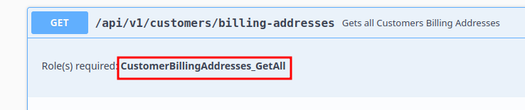
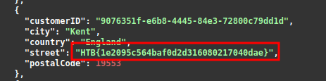

# Broken Function Level Authorization

```json
{
  "errorMessage": "User does not have any roles assigned"
}
```




```bash
curl -X 'GET' \ 'http://83.136.254.37:40649/api/v1/customers/billing-addresses' \ -H 'accept: application/json' \ -H 'Authorization: Bearer <REDACTED_JWT>'
```


