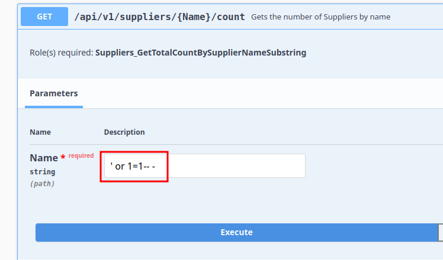
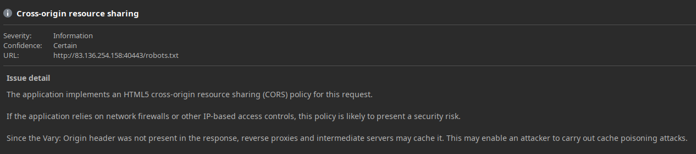
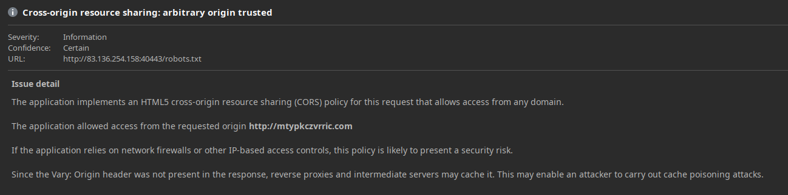

# Security Misconfiguration

```json
{
  "roles": [
    "Suppliers_GetTotalCountBySupplierNameSubstring"
  ]
}
```







## Procedencia

| Repositorio | Archivo original | Commit de origen |
| --- | --- | --- |
| CBBH | API Attacks/8 - Security Misconfiguration.md | 284a0a42d23a00f2b47b7460371a517a14cb6261 |

[Índice de categoría](../README.md) · [Inicio](../../README.md)
