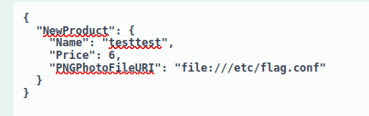
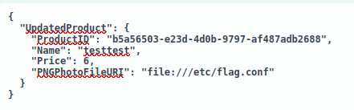

# Server Side Request Forgery

```json
{
  "roles": [
    "SupplierCompanies_Update",
    "SupplierCompanies_UploadCertificateOfIncorporation",
    "Products_CreateByCurrentUser",
    "Products_Update",
    "Products_UploadPhoto"
  ]
}
```


```json
{
  "successStatus": true,
  "productID": "11a871a6-5af3-4374-aec1-1cdcbe412f57"
}
```

##### /api/v1/products/current-user
Creates a new Product using the Supplier ID of the currently authenticated Supplier
Role(s) required: **Products_CreateByCurrentUser**



```json
"productID": "b5a56503-e23d-4d0b-9797-af487adb2688"
```
##### /api/v1/products/current-user

Updates a Product using the Supplier ID of the currently authenticated Supplier
A Product can be only updated by the Supplier that created it.  
Role(s) required: **None**




## Procedencia

| Repositorio | Archivo original | Commit de origen |
| --- | --- | --- |
| CBBH | API Attacks/7 - Server Side Request Forgery.md | 284a0a42d23a00f2b47b7460371a517a14cb6261 |

[Índice de categoría](../README.md) · [Inicio](../../README.md)
