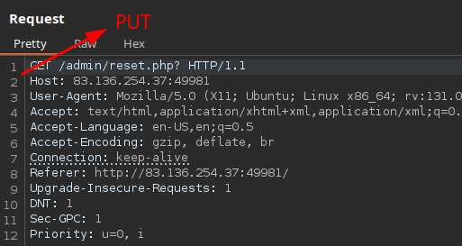
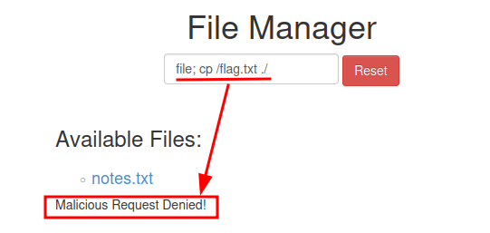
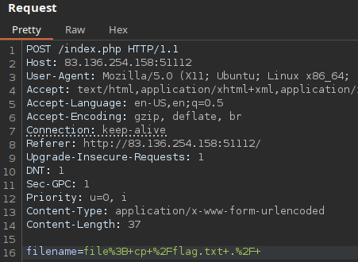

# HTTP Verb Tampering

## Bypassing Security Filters

Change request method to POST

## Procedencia

| Repositorio | Archivo original | Commit de origen |
| --- | --- | --- |
| CBBH | 15- Web Attacks/1 - HTTP Verb Tampering.md | 284a0a42d23a00f2b47b7460371a517a14cb6261 |

[Índice de categoría](../README.md) · [Inicio](../../README.md)
