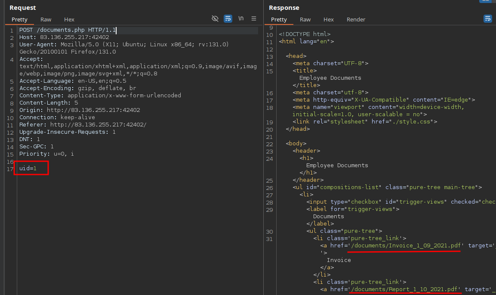
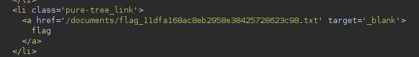
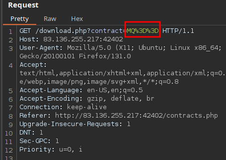
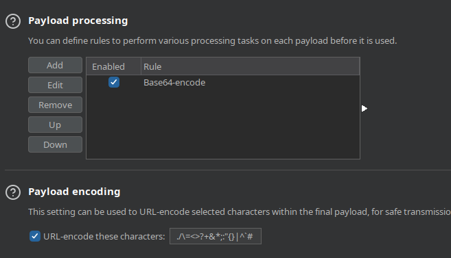
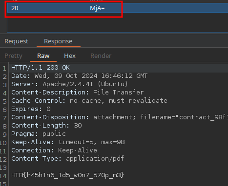
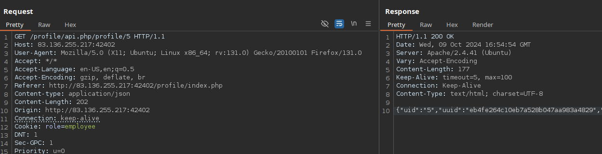

# IDOR



uid=15 



## Encoded References



```bash
echo "MQ==" | base64 -d  
1
```





## Insecure APIs



```json
{"uid":"10","uuid":"bfd92386a1b48076792e68b596846499","role":"staff_admin","full_name":"admin","email":"redacted@example.invalid","about":"Never gonna give you up, Never gonna let you down"}
```

We can modify other users' details
[Captura pendiente de revisión: Pasted image 20241009185945.png](../../Resources/Audit/media.csv)

## Procedencia

| Repositorio | Archivo original | Commit de origen |
| --- | --- | --- |
| CBBH | 15- Web Attacks/2 - IDOR.md | 284a0a42d23a00f2b47b7460371a517a14cb6261 |

Se han sustituido valores literales de autenticación o direcciones de correo por marcadores. Los detalles sin valores están en [el registro de redacciones](../../Resources/Audit/redactions.csv).

[Índice de categoría](../README.md) · [Inicio](../../README.md)
