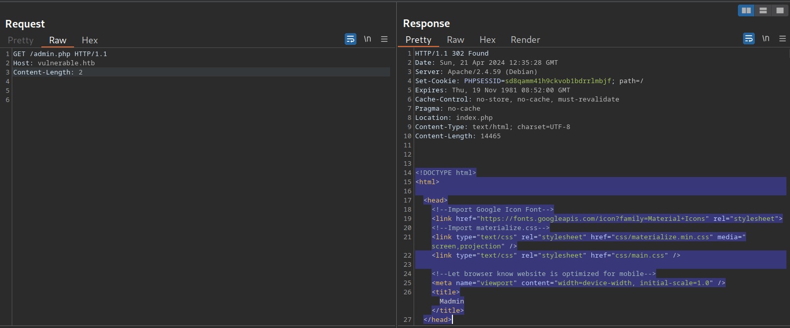
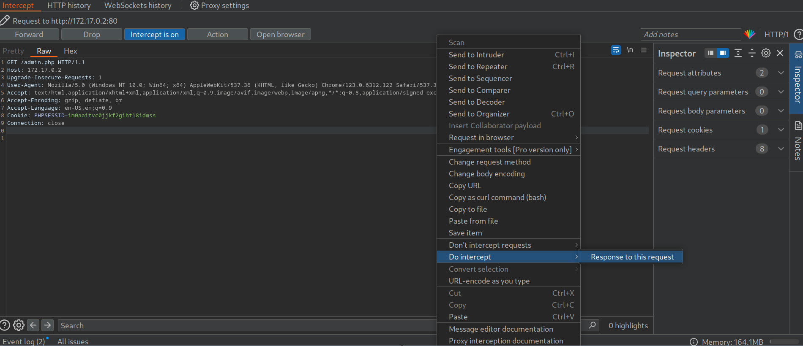
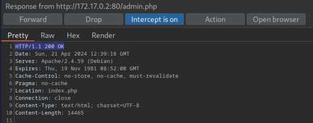
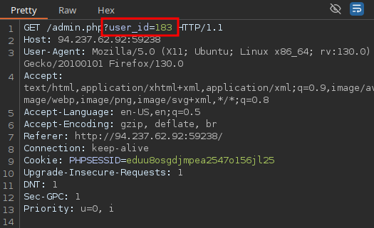
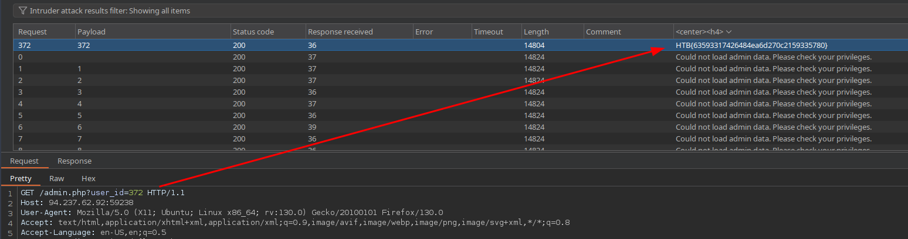

# Authentication Bypass

## Direct Access

This code redirects the user to `/index.php` if the session is not active, i.e., if the user is not authenticated. However, the PHP script does not stop execution, resulting in protected information within the page being sent in the response body:

The entire admin page is contained in the response body. However, if we attempt to access the page in our web browser, the browser follows the redirect and displays the login prompt instead of the protected admin page. We can easily trick the browser into displaying the admin page by intercepting the response and changing the status code from `302` to `200`.

Afterward, forward the request by clicking on `Forward`. Since we intercepted the response, we can now edit it. To force the browser to display the content, we need to change the status code from `302 Found` to `200 OK`:

## Authentication Bypass via Parameter Modification

## Procedencia

| Repositorio | Archivo original | Commit de origen |
| --- | --- | --- |
| CBBH | 14- Broken Authentication/2 - Authentication Bypass.md | 284a0a42d23a00f2b47b7460371a517a14cb6261 |

[Índice de categoría](../README.md) · [Inicio](../../README.md)
