# Login Pages - Authentication (HackingHub)

## Weak Passwords

[Captura pendiente de revisión: Pasted image 20241217114441.png](../../Resources/Audit/media.csv)

## Default Passwords

Search for "Default credentials" on google

## Username enumeration through errors

Username is invalid

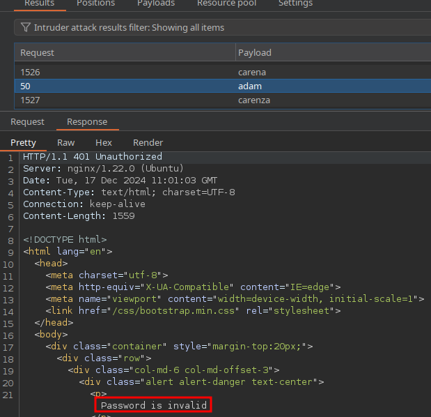
## Username Enumeration Through Forgot Password Function

Invalid username supplied

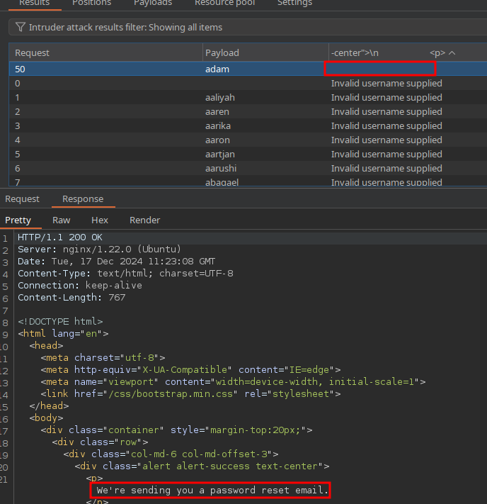

## Brute Forcing Username and Password

Cluster-bomb

## Self Registration Using Content Discovery

```bash
ffuf -u https://vdooaly3.eu1.ctfio.com/hidden-registration/user_FUZZ -w content.txt
```

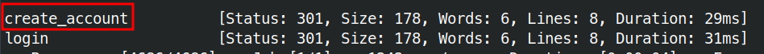

### Javascript Files

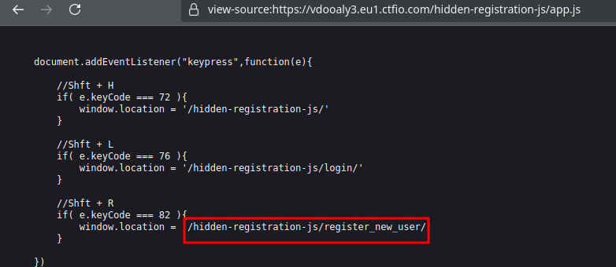

### APIs

Leaked ``/by-api/api/auth/login/``

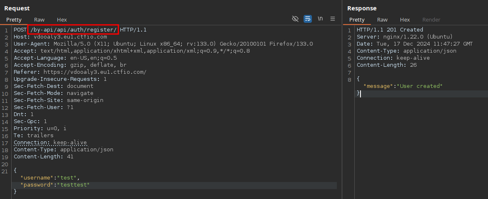

## Brute Forcing One-Time Password (OTP)

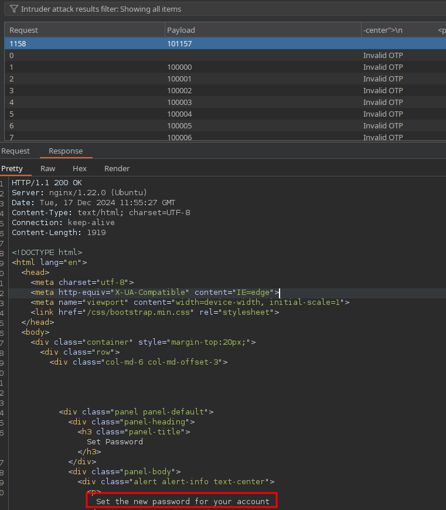

## Leaked Password Reset Tokens
### 1
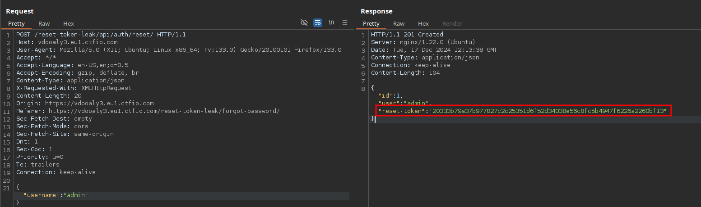

```bash
ffuf -u https://vdooaly3.eu1.ctfio.com/reset-token-leak/FUZZ -w /usr/share/seclists/Discovery/Web-Content/directory-list-2.3-medium.txt
```

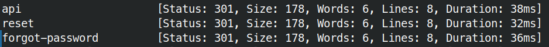

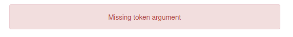

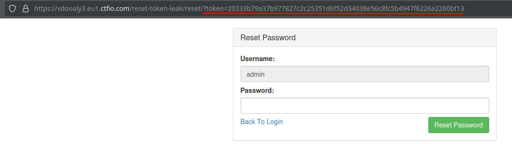

### 2

```bash
ffuf -u https://vdooaly3.eu1.ctfio.com/api-token-leak/api/FUZZ -w /usr/share/seclists/Discovery/Web-Content/directory-list-2.3-medium.txt
```

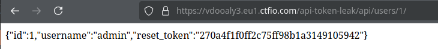

## Forced Password Reset

Add email field, 
[Captura pendiente de revisión: Pasted image 20241217134424.png](../../Resources/Audit/media.csv)

https://github.com/Vozec/CVE-2023-7028


```text
user[email][]=redacted@example.invalid&user[email][]=redacted@example.invalid
```

## Bypassing API Authentication with X-Forwarded-For

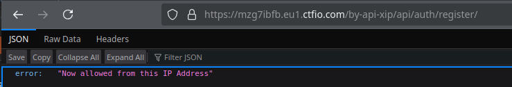


```text
X-forwarded-for: 127.0.0.1
```

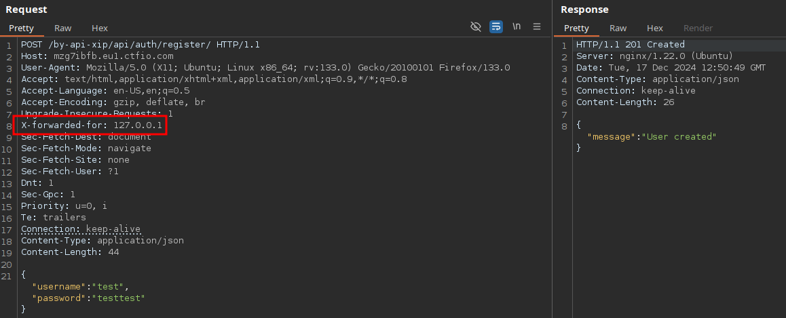
## X-Forwarded-For with Information Disclosure

```bash
curl -I https://mzg7ibfb.eu1.ctfio.com/by-api-xip-2/admin/
```

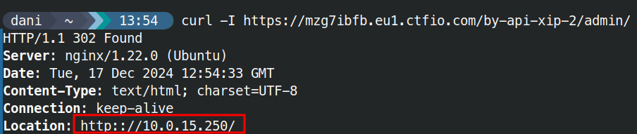

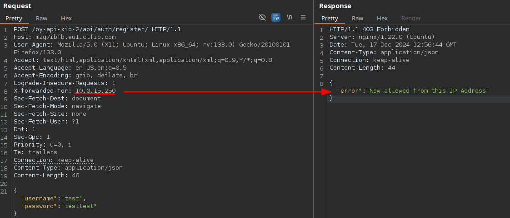
Brute force, 
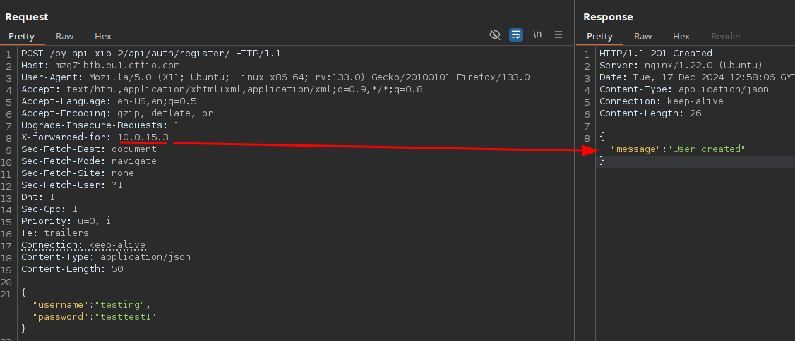
## Mass Assignment

[Captura pendiente de revisión: Pasted image 20241217154708.png](../../Resources/Audit/media.csv)

Add status on the register, 

[Captura pendiente de revisión: Pasted image 20241217154902.png](../../Resources/Audit/media.csv)

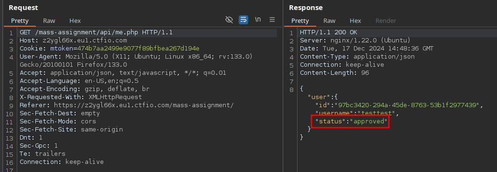

## Procedencia

| Repositorio | Archivo original | Commit de origen |
| --- | --- | --- |
| CBBH | BB/hackinghub/Login Pages - Authentication.md | 284a0a42d23a00f2b47b7460371a517a14cb6261 |

Se han sustituido valores literales de autenticación o direcciones de correo por marcadores. Los detalles sin valores están en [el registro de redacciones](../../Resources/Audit/redactions.csv).

[Índice de categoría](../README.md) · [Inicio](../../README.md)
