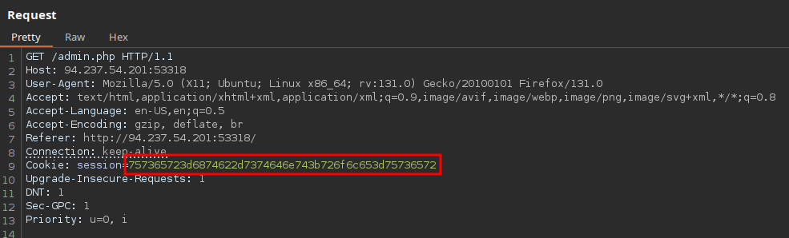
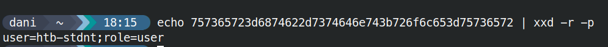

# Session Tokens





```bash
echo -n 'user=htb-stdnt;role=admin' | xxd -p

757365723d6874622d7374646e743b726f6c653d61646d696e
```

## Procedencia

| Repositorio | Archivo original | Commit de origen |
| --- | --- | --- |
| CBBH | 14- Broken Authentication/3 - Session Tokens.md | 284a0a42d23a00f2b47b7460371a517a14cb6261 |

[Índice de categoría](../README.md) · [Inicio](../../README.md)
