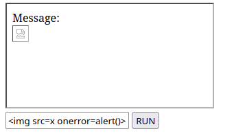
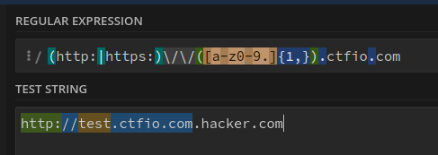

# postMessage (HackingHub)

## Dangers of PostMessage(XSS)
```html
<html>
<head>
    <script>
        let btn = function(){
            msg = {
                'msg'   :   document.getElementById('msg').value
            }
            document.getElementById('frame').contentWindow.postMessage(msg,'*');
        }
    </script>
</head>
<body>
<iframe src="https://pm.nahamseclab.com/four_target" id="frame"></iframe><br>
<input id="msg" value="Hello IFRAME">
<button onclick="btn()">RUN</button>
</body>
</html>
```

```html
    <script>
        window.addEventListener("message",function(event){
            if( event.data.hasOwnProperty('msg') ) {
                document.getElementById('message').innerHTML = event.data.msg;
            }
        });
    </script>
```



## Protecting PostMessage Origin

```html
	<script>
        window.addEventListener("message",function(event){
            if (event.data.hasOwnProperty('msg')) {
                if( event.origin === 'https://only-from-this-domain.com' ) {
                    document.getElementById('message').innerHTML = event.data.msg;
                }else{
                    alert("You're not allowed to send from here!");
                }
            }
        });
    </script>
```

## Exploiting PostMessage Origin Checks

```html
    <script>
        window.addEventListener("message",function(event){
            if (event.data.hasOwnProperty('msg')) {
                if( /(http:|https:)\/\/([a-z0-9.]{1,}).ctfio.com/.test( event.origin ) ) {
                    document.getElementById('message').innerHTML = event.data.msg;
                }else{
                    alert("You're not allowed to send from here!");
                }
            }
        });
    </script>
```

### Subdomain Regex Bypass


## PostMessage targetOrigin Exploitation

```html
    <script>
        function auth() {
            let data = {
                'user': {
                    'username': 'adam',
                    'token': '<REDACTED_TOKEN>'
                }
            }
            window.parent.postMessage(data, '*');
        }
    </script>
```

[Captura pendiente de revisión: Pasted image 20241129165809.png](../../Resources/Audit/media.csv)

### Secure PostMessage targetOrigin

```html
window.parent.postMessage(data, 'https://service.protected.com');
```

## Procedencia

| Repositorio | Archivo original | Commit de origen |
| --- | --- | --- |
| CBBH | BB/hackinghub/Client side/postMessage.md | 284a0a42d23a00f2b47b7460371a517a14cb6261 |

Se han sustituido valores literales de autenticación o direcciones de correo por marcadores. Los detalles sin valores están en [el registro de redacciones](../../Resources/Audit/redactions.csv).

[Índice de categoría](../README.md) · [Inicio](../../README.md)
