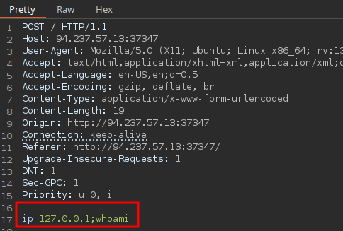

# Exploitation

| **Injection Operator** | **Injection Character** | **URL-Encoded Character** | **Executed Command**                       |
| ---------------------- | ----------------------- | ------------------------- | ------------------------------------------ |
| Semicolon              | `;`                     | `%3b`                     | Both                                       |
| New Line               | `\n`                    | `%0a`                     | Both                                       |
| Background             | `&`                     | `%26`                     | Both (second output generally shown first) |
| Pipe                   | `\|`                    | `%7c`                     | Both (only second output is shown)         |
| AND                    | `&&`                    | `%26%26`                  | Both (only if first succeeds)              |
| OR                     | `\|`                    | `%7c%7c`                  | Second (only if first fails)               |
| Sub-Shell              | ` `` `                  | `%60%60`                  | Both (Linux-only)                          |
| Sub-Shell              | `$()`                   | `%24%28%29`               | Both (Linux-only)                          |

*ctrl+u in burpsuite to URL encoding*

## Procedencia

| Repositorio | Archivo original | Commit de origen |
| --- | --- | --- |
| CBBH | 10- Command Injections/1 - Explotation.md | 284a0a42d23a00f2b47b7460371a517a14cb6261 |

[Índice de categoría](../README.md) · [Inicio](../../README.md)
