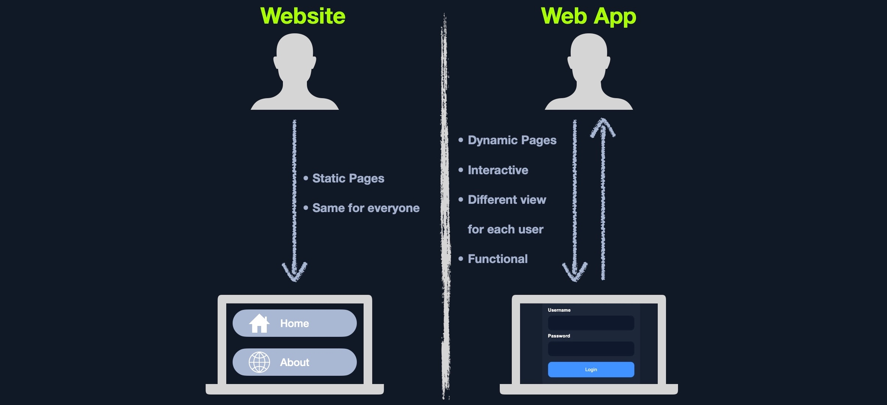
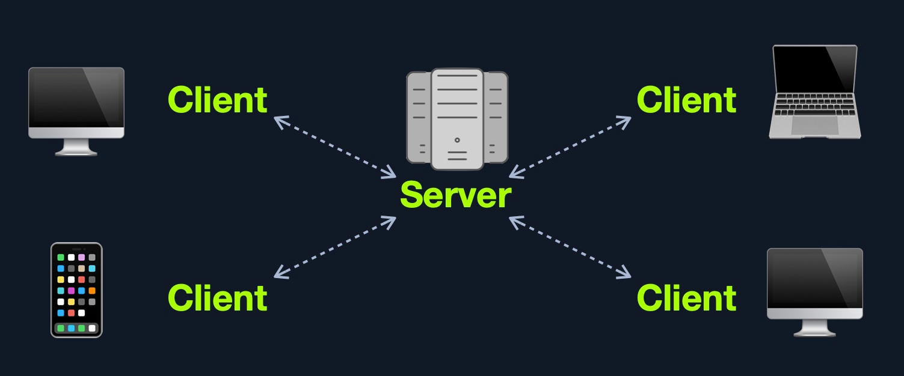
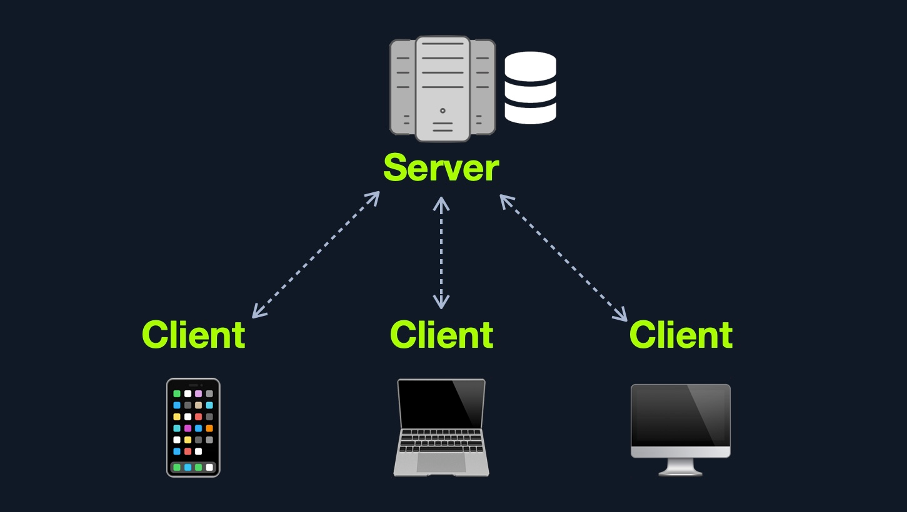
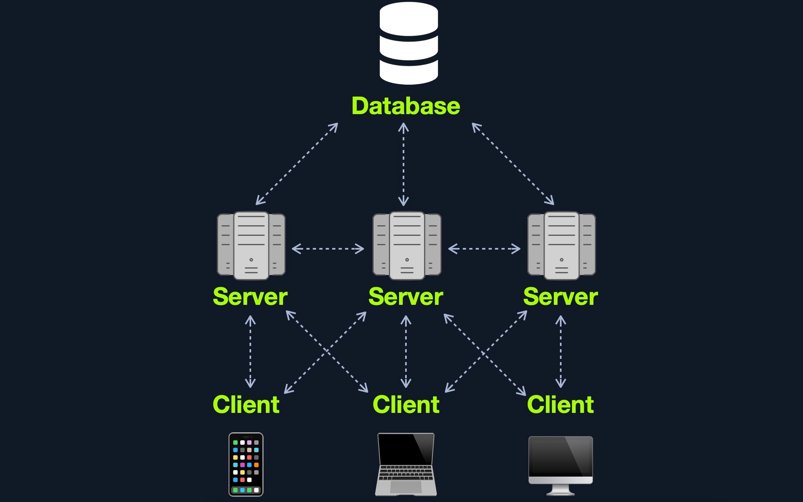
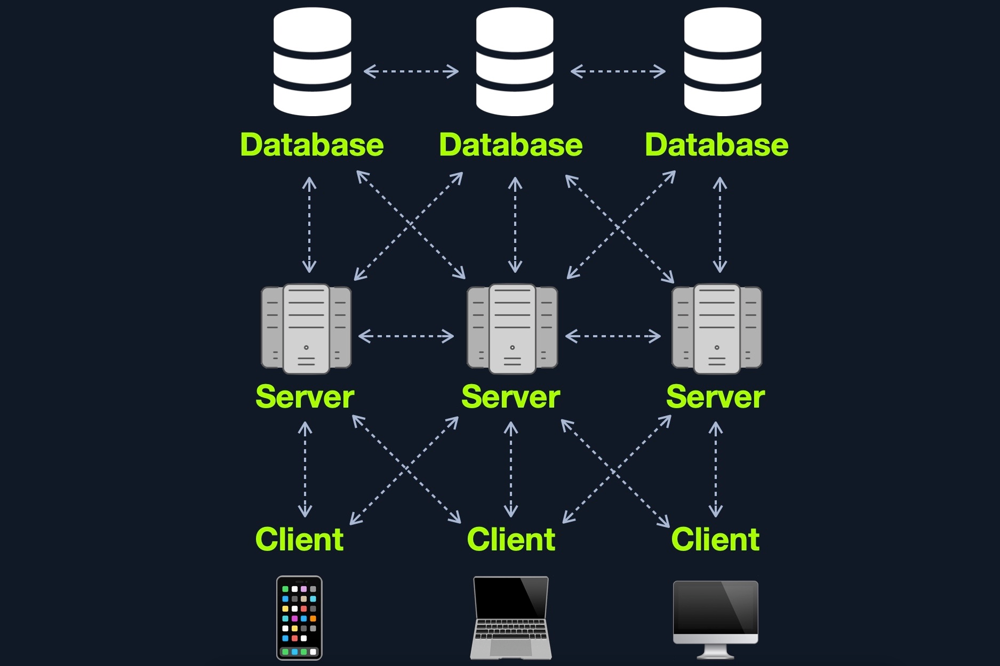
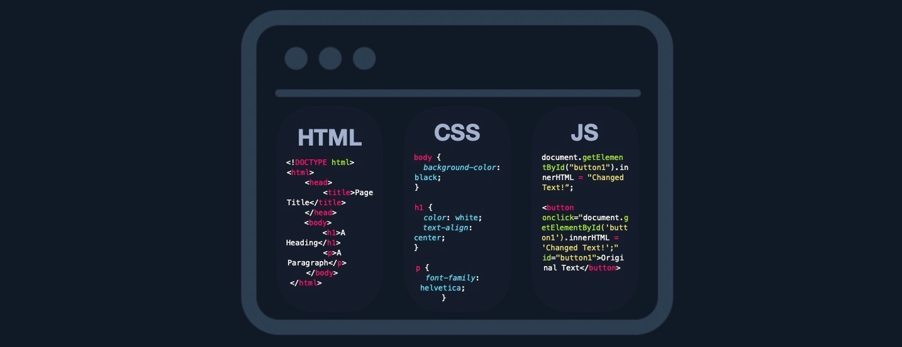

# Arquitectura de aplicaciones web

## Introduction

### Introduction

Web applications are interactive applications that run on web browsers. They usually adopt a client-server architecture to handle interactions. These applications have front-end components (i.e., the website interface, or "what the user sees") running on the client-side (browser) and back-end components (web application source code) running on the server-side (back end server/databases).

This setup allows organizations to host powerful applications with real-time control over their design and functionality while being accessible worldwide. Examples include online email services like Gmail, online retailers like Amazon, and online word processors like Google Docs.

Web applications can be developed by any web developer and hosted on common hosting services, used by anyone on the internet. Today, there are millions of web applications globally, with billions of users interacting with them daily.

#### Web Applications vs. Websites

Previously, we interacted with static websites that couldn't be changed in real-time (Web 1.0). Traditional static websites were designed to display specific information, which could only be altered by developers manually. These websites lacked real-time interactivity and functionality.

In contrast, modern websites running web applications (Web 2.0) present dynamic content based on user interaction. Key differences between websites and web applications include:
- Modularity
- Cross-device compatibility
- Platform independence without optimization requirements

#### Web Applications vs. Native OS Applications

Web applications are platform-independent and run in browsers, making them accessible on any operating system without installation. Their functionality is executed on remote servers, saving space on the user's hard drive. Another advantage is version unity—users always access the same version, which can be updated centrally without requiring individual updates.

However, native OS applications offer faster operation, deeper integration with the operating system, and local hardware utilization. Despite this, hybrid and progressive web applications now use modern frameworks to achieve performance close to native applications.

#### Web Application Distribution

Organizations utilize both open-source and proprietary web applications. Common open-source examples include:
- WordPress
- OpenCart
- Joomla

Proprietary web applications, typically offered via subscription models, include:
- Wix
- Shopify
- DotNetNuke

#### Security Risks of Web Applications

Web application attacks are common and pose significant risks. Since these applications are accessible from anywhere, they offer a large attack surface. Many tools for scanning and attacking web applications are readily available, making them attractive targets for malicious actors.

A successful attack can lead to business disruptions, compromised data, and financial losses. Web applications often store sensitive data on the same server hosting the application, so if an attacker breaches the application, they could access sensitive user or corporate data. 

This makes vulnerability testing critical. Regular penetration testing and secure coding practices throughout the development lifecycle are necessary for protecting web applications. The OWASP Web Security Testing Guide provides one of the most current methodologies for testing web applications.

Penetration testing begins with analyzing front-end components (HTML, CSS, JavaScript) for vulnerabilities like Sensitive Data Exposure and Cross-Site Scripting (XSS). Then, testers review the core functionality and server-side interactions, assessing the web application from both unauthenticated and authenticated perspectives.

#### Attacking Web Applications

Many companies, regardless of size, host web applications. These can range from static websites to dynamic applications with sign-up/login functionalities. Web applications provide a vast attack surface and can be vulnerable due to overlooked security flaws. A small code change might introduce catastrophic vulnerabilities or allow for attack chaining to exploit sensitive data or execute code remotely.

Common vulnerabilities in web applications include:
- **SQL Injection**: This flaw occurs when user input is unsafely handled, potentially leading to unauthorized data access or remote code execution.
- **File Inclusion**: Attackers can exploit poorly validated file paths to read sensitive files or execute code on the server.
- **Unrestricted File Upload**: Allows attackers to upload malicious files, leading to remote code execution.
- **Insecure Direct Object Referencing (IDOR)**: Occurs when user-controlled parameters can access unauthorized data or functionality.
- **Broken Access Control**: Attackers can exploit weak access control mechanisms to escalate privileges or access unauthorized features.

Understanding these vulnerabilities is key to web application penetration testing and can set apart security professionals who can uncover flaws others might miss.

#### Real-World Examples of Web Application Attacks

| **Flaw**                      | **Real-world Scenario**                                                                                                                                   |
|-------------------------------|-----------------------------------------------------------------------------------------------------------------------------------------------------------|
| **SQL Injection**              | Obtaining Active Directory usernames and performing a password spray attack against a VPN or email portal.                                                 |
| **File Inclusion**             | Reading source code to find a hidden page or directory, exposing functionality that can lead to remote code execution.                                      |
| **Unrestricted File Upload**   | Uploading malicious code to gain control of the web application server.                                                                                    |
| **Insecure Direct Object Reference (IDOR)** | Changing a URL parameter to access another user’s files or account functionality.                                                              |
| **Broken Access Control**      | Manipulating account registration parameters to escalate privileges and register as an admin user.                                                        |

It’s important to familiarize yourself with these attacks as you progress in your penetration testing journey. Developing a deep understanding of web applications and attack techniques will help you stand out in the field of security testing and discover vulnerabilities others may overlook.

## Web Application Layout

Web application layouts consist of many different layers that can be summarized with the following three main categories:

|**Category**|**Description**|
|---|---|
|`Web Application Infrastructure`|Describes the structure of required components, such as the database, needed for the web application to function as intended. Since the web application can be set up to run on a separate server, it is essential to know which database server it needs to access.|
|`Web Application Components`|The components that make up a web application represent all the components that the web application interacts with. These are divided into the following three areas: `UI/UX`, `Client`, and `Server` components.|
|`Web Application Architecture`|Architecture comprises all the relationships between the various web application components.|

#### Web Application Infrastructure

Web applications can use many different infrastructure setups. These are also called `models`. The most common ones can be grouped into the following four types:

##### Client-Server

##### One Server

##### Many Servers - One Database

##### Many Servers - Many Databases

#### Web Application Components

1. `Client`
2. `Server`
    - Webserver
    - Web Application Logic
    - Database
3. `Services` (Microservices)
    - 3rd Party Integrations
    - Web Application Integrations
4. `Functions` (Serverless)

#### Web Application Architecture

The components of a web application are divided into three different layers (AKA Three Tier Architecture).

|**Layer**|**Description**|
|---|---|
|`Presentation Layer`|Consists of UI process components that enable communication with the application and the system. These can be accessed by the client via the web browser and are returned in the form of HTML, JavaScript, and CSS.|
|`Application Layer`|This layer ensures that all client requests (web requests) are correctly processed. Various criteria are checked, such as authorization, privileges, and data passed on to the client.|
|`Data Layer`|The data layer works closely with the application layer to determine exactly where the required data is stored and can be accessed.|
#### Microservices

Microservices are independent components within a web application, each designed for a specific task, such as registration, search, payments, etc. These components communicate with each other and the client in a stateless manner, as data is stored separately. Microservices are part of service-oriented architecture (SOA) and can be written in different programming languages. Benefits include agility, flexible scaling, easy deployment, reusable code, and resilience.

#### Serverless Architecture

Serverless architecture, offered by cloud providers like AWS and GCP, allows applications to run without managing servers, streamlining development and deployment processes.

#### Architecture Security

In web application security, architectural design flaws, such as improper Role-Based Access Control (RBAC), can lead to vulnerabilities. Security must be prioritized during the development lifecycle, and penetration tests are essential to identify such issues.

## Front End vs Back End

### Front End

The front end of a web application contains the user's components directly through their web browser (client-side). These components make up the source code of the web page we view when visiting a web application and usually include `HTML`, `CSS`, and `JavaScript`, which is then interpreted in real-time by our browsers.

### Back End

The back end of a web application drives all of the core web application functionalities, all of which is executed at the back end server, which processes everything required for the web application to run correctly. It is the part we may never see or directly interact with, but a website is just a collection of static web pages without a back end.

|**Component**|**Description**|
|---|---|
|`Back end Servers`|The hardware and operating system that hosts all other components and are usually run on operating systems like `Linux`, `Windows`, or using `Containers`.|
|`Web Servers`|Web servers handle HTTP requests and connections. Some examples are `Apache`, `NGINX`, and `IIS`.|
|`Databases`|Databases (`DBs`) store and retrieve the web application data. Some examples of relational databases are `MySQL`, `MSSQL`, `Oracle`, `PostgreSQL`, while examples of non-relational databases include `NoSQL` and `MongoDB`.|
|`Development Frameworks`|Development Frameworks are used to develop the core Web Application. Some well-known frameworks include `Laravel` (`PHP`), `ASP.NET` (`C#`), `Spring` (`Java`), `Django` (`Python`), and `Express` (`NodeJS JavaScript`).|

## Procedencia

| Repositorio | Archivo original | Commit de origen |
| --- | --- | --- |
| CBBH | 2- Introduction to Web Applications/1 - Introduction to Web Applications/1 - Introduction.md | 284a0a42d23a00f2b47b7460371a517a14cb6261 |
| CBBH | 2- Introduction to Web Applications/1 - Introduction to Web Applications/2 - Web Application Layout.md | 284a0a42d23a00f2b47b7460371a517a14cb6261 |
| CBBH | 2- Introduction to Web Applications/1 - Introduction to Web Applications/3 - Front End vs Back End.md | 284a0a42d23a00f2b47b7460371a517a14cb6261 |

[Índice de categoría](../README.md) · [Inicio](../../README.md)
