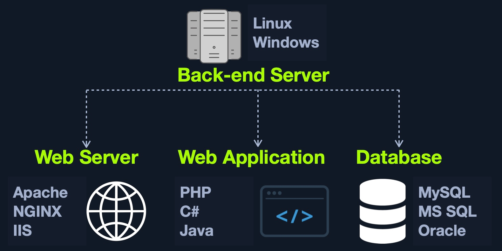
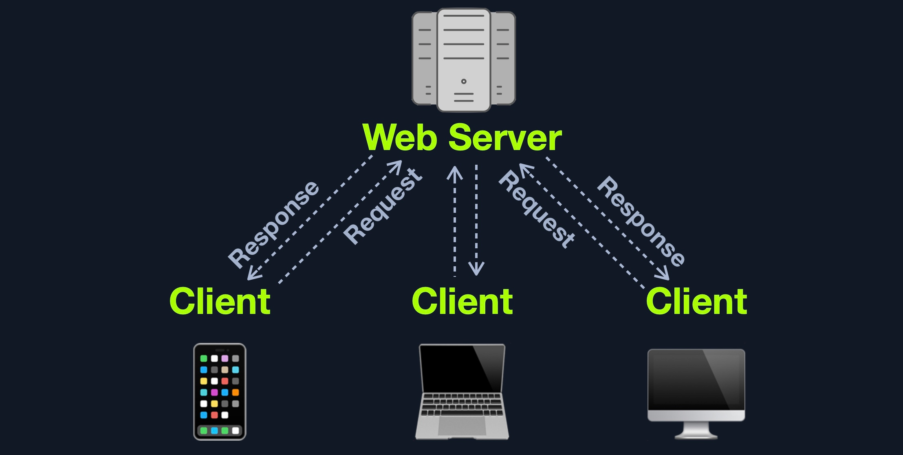
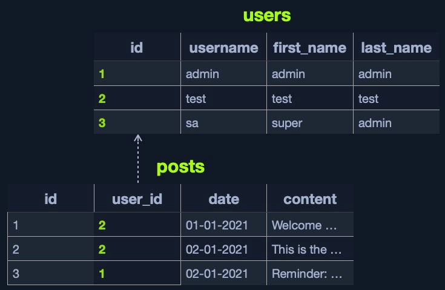
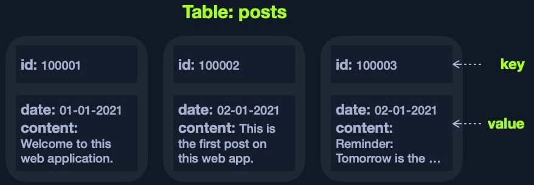

# Servidores, bases de datos y APIs

Las descripciones de productos y ejemplos son apuntes históricos. NoSQL agrupa varios modelos; no implica que todos carezcan de esquemas o relaciones. El ejemplo que concatena entrada en una consulta SQL es inseguro y se conserva como material explicativo. SOAP significa Simple Object Access Protocol; REST es un estilo arquitectónico y no obliga a usar JSON.

## Back End Servers



###### Examples: 

|Combinations|Components|
|---|---|
|[LAMP](https://en.wikipedia.org/wiki/LAMP_(software_bundle))|`Linux`, `Apache`, `MySQL`, and `PHP`.|
|[WAMP](https://en.wikipedia.org/wiki/LAMP_(software_bundle)#WAMP)|`Windows`, `Apache`, `MySQL`, and `PHP`.|
|[WINS](https://en.wikipedia.org/wiki/Solution_stack)|`Windows`, `IIS`, `.NET`, and `SQL Server`|
|[MAMP](https://en.wikipedia.org/wiki/MAMP)|`macOS`, `Apache`, `MySQL`, and `PHP`.|
|[XAMPP](https://en.wikipedia.org/wiki/XAMPP)|Cross-Platform, `Apache`, `MySQL`, and `PHP/PERL`.|
https://en.wikipedia.org/wiki/Solution_stack

## Web Servers



- Apache
- Nginx
- IIS

## Databases

### Relational (SQL)

[Relational](https://en.wikipedia.org/wiki/Relational_database) (SQL) databases store their data in tables, rows, and columns. Each table can have unique keys, which can link tables together and create relationships between tables.



|Type|Description|
|---|---|
|[MySQL](https://en.wikipedia.org/wiki/MySQL)|The most commonly used database around the internet. It is an open-source database and can be used completely free of charge|
|[MSSQL](https://en.wikipedia.org/wiki/Microsoft_SQL_Server)|Microsoft's implementation of a relational database. Widely used with Windows Servers and IIS web servers|
|[Oracle](https://en.wikipedia.org/wiki/Oracle_Database)|A very reliable database for big businesses, and is frequently updated with innovative database solutions to make it faster and more reliable. It can be costly, even for big businesses|
|[PostgreSQL](https://en.wikipedia.org/wiki/PostgreSQL)|Another free and open-source relational database. It is designed to be easily extensible, enabling adding advanced new features without needing a major change to the initial database design|

### Non-relational (NoSQL)

A [non-relational database](https://en.wikipedia.org/wiki/NoSQL) uses models other than the relational table model. Schema constraints and relationship support depend on the database. Instead, a `NoSQL` database stores data using various storage models, depending on the type of data stored.

There are 4 common storage models for `NoSQL` databases:

- Key-Value
- Document-Based
- Wide-Column
- Graph



|Type|Description|
|---|---|
|[MongoDB](https://en.wikipedia.org/wiki/MongoDB)|The most common `NoSQL` database. It is free and open-source, uses the `Document-Based` model, and stores data in `JSON` objects|
|[ElasticSearch](https://en.wikipedia.org/wiki/Elasticsearch)|Another free and open-source `NoSQL` database. It is optimized for storing and analyzing huge datasets. As its name suggests, searching for data within this database is very fast and efficient|
|[Apache Cassandra](https://en.wikipedia.org/wiki/Apache_Cassandra)|Also free and open-source. It is very scalable and is optimized for gracefully handling faulty values|

### Use in Web Applications

Connect to the database server: 
```php
$conn = new mysqli("localhost", "user", "pass");
```

Create a new database:
```php
$sql = "CREATE DATABASE database1";
$conn->query($sql)
```

Connect to our new database, and start using the `MySQL` database through `MySQL` syntax
```php
$conn = new mysqli("localhost", "user", "pass", "database1");
$query = "select * from table_1";
$result = $conn->query($query);
```

Web applications usually use user-input when retrieving data. For example, when a user uses the search function to search for other users, their search input is passed to the web application, which uses the input to search within the database(s).
```php
$searchInput =  $_POST['findUser'];
$query = "select * from users where name like '%$searchInput%'";
$result = $conn->query($query);
```

Finally, the web application sends the result back to the user:
```php
while($row = $result->fetch_assoc() ){
	echo $row["name"]."<br>";
}
```

## Development Frameworks & APIs

- [Laravel](https://laravel.com/) (`PHP`): usually used by startups and smaller companies, as it is powerful yet easy to develop for.
- [Express](https://expressjs.com/) (`Node.JS`): used by `PayPal`, `Yahoo`, `Uber`, `IBM`, and `MySpace`.
- [Django](https://www.djangoproject.com/) (`Python`): used by `Google`, `YouTube`, `Instagram`, `Mozilla`, and `Pinterest`.
- [Rails](https://rubyonrails.org) (`Ruby`): used by `GitHub`, `Hulu`, `Twitch`, `Airbnb`, and even `Twitter` in the past.

### APIs

An important aspect of back end web application development is the use of Web [APIs](https://en.wikipedia.org/wiki/API) and HTTP Request parameters to connect the front end and the back end to be able to send data back and forth between front end and back end components and carry out various functions within the web application.

### Web APIs

An API ([Application Programming Interface](https://en.wikipedia.org/wiki/API)) is an interface within an application that specifies how the application can interact with other applications. For Web Applications, it is what allows remote access to functionality on back end components. APIs are not exclusive to web applications and are used for software applications in general. Web APIs are usually accessed over the `HTTP` protocol and are usually handled and translated through web servers.

### SOAP

The `SOAP` ([Simple Object Access](https://en.wikipedia.org/wiki/SOAP)) standard shares data through `XML`, where the request is made in `XML` through an HTTP request, and the response is also returned in `XML`. Front end components are designed to parse this `XML` output properly. The following is an example `SOAP` message:

```xml
<?xml version="1.0"?>

<soap:Envelope
xmlns:soap="http://www.example.com/soap/soap/"
soap:encodingStyle="http://www.w3.org/soap/soap-encoding">

<soap:Header>
</soap:Header>

<soap:Body>
  <soap:Fault>
  </soap:Fault>
</soap:Body>

</soap:Envelope>
```

### REST

The `REST` ([Representational State Transfer](https://en.wikipedia.org/wiki/Representational_state_transfer)) architectural style is often implemented in web APIs exposing resources through URL paths 'i.e. `search/users/1`', and usually returns the output in `JSON` format 'i.e. userid `1`'.

```bash
curl http://83.136.254.47:35777/index.php?id=1
```

## Procedencia

| Repositorio | Archivo original | Commit de origen |
| --- | --- | --- |
| CBBH | 2- Introduction to Web Applications/4 - Back End Components/1 - Back End Servers.md | 284a0a42d23a00f2b47b7460371a517a14cb6261 |
| CBBH | 2- Introduction to Web Applications/4 - Back End Components/2 - Web Servers.md | 284a0a42d23a00f2b47b7460371a517a14cb6261 |
| CBBH | 2- Introduction to Web Applications/4 - Back End Components/3 - Databases.md | 284a0a42d23a00f2b47b7460371a517a14cb6261 |
| CBBH | 2- Introduction to Web Applications/4 - Back End Components/4 - Development Frameworks & APIs.md | 284a0a42d23a00f2b47b7460371a517a14cb6261 |

[Índice de categoría](../README.md) · [Inicio](../../README.md)

Referencias para las correcciones: [Modelo de datos y esquemas en MongoDB](https://www.mongodb.com/docs/manual/data-modeling/) · [Definición de REST por Roy Fielding](https://www-dev.ics.uci.edu/~fielding/pubs/dissertation/rest_arch_style.htm).
