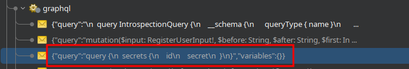
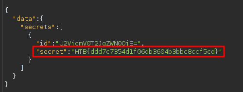

# Information Disclosure

https://github.com/dolevf/graphw00f

[Introspection](https://graphql.org/learn/introspection/) is a GraphQL feature that enables users to query the GraphQL API about the structure of the backend system. As such, users can use introspection queries to obtain all queries supported by the API schema. These introspection queries query the `__schema` field.

In Repeater, right-click anywhere within the **Request** panel of the message editor, then select **GraphQL > Set introspection query** to insert an introspection query into the request body.

**GraphQL > Save GraphQL queries to site map**

